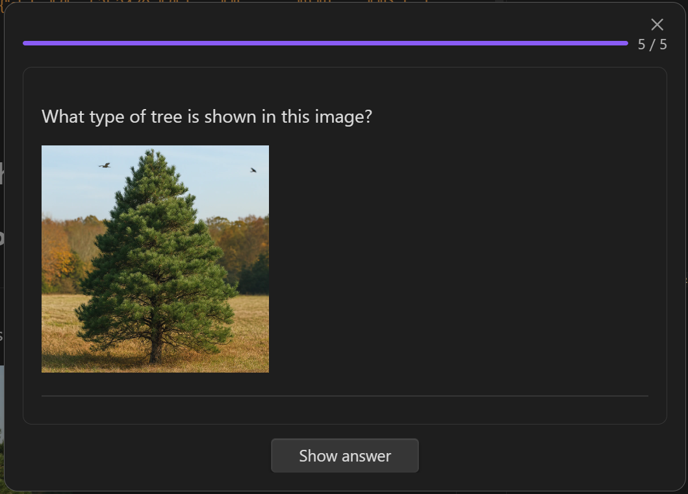

# Osmosis

**Absorb information faster and longer with unified notes, flashcards, and mind mapping.**

Osmosis turns your markdown notes into interactive mind maps and study material. Write once, study in multiple modes. No duplicate content, no external tools, no proprietary formats.

[](https://www.gnu.org/licenses/gpl-3.0)
[](https://obsidian.md)


## Features

- **Interactive Mind Maps** — Your headings become branches, lists become nodes. Edit the map and the Markdown updates. Edit the Markdown and the map updates.
- **Five Card Types** — Basic Q&A, bidirectional, type-in, cloze deletion, and code cloze — all defined with a simple code fence syntax
- **FSRS Spaced Repetition** — The same algorithm powering modern Anki, built right into your notes
- **Three Study Modes** — Sequential (classic card review), contextual (study inline in your notes), and spatial (study on the mind map itself)
- **Plain Markdown** — Everything lives in your files. Card scheduling data is stored in the fences themselves — no external databases, no sync issues
- **Themes and Styling** — Customize mind map appearance with built-in themes, colors, and layout options
- **Keyboard Navigation** — Full keyboard support for mind map editing and study sessions
- **Dashboard** — See all your decks, due card counts, and study statistics at a glance

## Why Osmosis?

Most mind mapping and flashcard tools force you to choose: either your notes are the source of truth, or the tool is. Osmosis refuses that tradeoff.

🗺️ **Not just a viewer — a full editor.** Tools like [Markmap](https://markmap.js.org/) render beautiful mind maps from Markdown, but they're read-only. Osmosis mind maps are fully interactive — add nodes, edit text, rearrange branches — and every change writes back to your Markdown instantly.

🔓 **Not proprietary — plain Markdown.** Tools like [Xmind](https://xmind.com/) are powerful mind mappers, but your data lives in a proprietary format. Markdown export is an afterthought. With Osmosis, Markdown *is* the format. Your notes work everywhere, with every tool, forever.

🤖 **AI-native by design.** Plain Markdown means AI assistants can read, generate, and edit your content natively — flashcards, mind maps, study material — no export, no conversion, no friction.

🧩 **Notes + mind maps + flashcards in one file.** Other tools force you to maintain these in separate apps. Osmosis unifies all three in a single Markdown file. Your headings become mind map branches. Your `osmosis` code fences become flashcards. One file, three views, zero duplication.

🧭 **Spatial study mode.** Study your flashcards *on* the mind map. Cards appear right where they belong in your knowledge structure — no other tool lets you see how each fact connects to the bigger picture while you review.

📝 **Contextual study mode.** Study cards inline in your notes, right where you wrote them. Review surrounded by your own explanations and examples instead of being yanked into a separate flashcard app.

🔗 **Mind map transclusion.** Embed one mind map inside another with `![[note]]`. Build a master map of an entire subject by transcluding individual topic maps — zoom from the 30,000-foot view down to granular detail.

## Who It's For

**The Med Student** — You're drowning in anatomy, pharmacology, and pathology. You already use Anki, but maintaining two separate systems — notes and flashcards — is killing your workflow. Osmosis lets you define flashcards right inside your lecture notes, so your study material lives where you take notes. Mind maps help you see how body systems connect. FSRS keeps you on schedule.

**The Self-Taught Developer** — You're learning a new language, framework, or codebase on your own. Code cloze cards let you drill syntax and API patterns. Mind maps give you the big-picture architecture view. Everything stays in the same Markdown files you already take notes in.

**The Lifelong Learner** — You read books, watch lectures, and take notes — but forget most of it within weeks. Spaced repetition fixes that. Osmosis lets you embed flashcards right where you take notes, so you actually retain what you learn. No separate app, no export step.

**The Obsidian Power User** — You've built your second brain in Obsidian and you want mind mapping and spaced repetition without leaving the ecosystem. No proprietary formats, no external accounts, no sync issues. Plain Markdown, full ownership.

**The Visual Thinker** — Outlines and bullet points don't click for you. You need to see the structure. Osmosis turns any Markdown file into an interactive mind map you can edit, rearrange, and study from — bridging the gap between linear notes and spatial understanding.

## Views

### Mind Map View


Your Markdown rendered as a fully interactive mind map:

- Headings become branches, lists become child nodes
- Click any node to edit — changes sync back to the Markdown instantly
- Pan, zoom, and navigate with keyboard shortcuts
- Multiple themes and color schemes
- Viewport culling for large documents (1000+ nodes)

### Flashcard View




Cards defined with a simple `osmosis` code fence:

- **Basic** — Question and answer
- **Bidirectional** — Study in both directions
- **Type-in** — Type your answer before revealing
- **Cloze** — Fill-in-the-blank with `==highlighted==` or `**bold**` markers
- **Code Cloze** — Cloze deletions inside code blocks

### Study Dashboard


Central hub for all your study sessions:

- Deck overview with due card counts
- Study statistics and progress tracking
- One-click access to sequential, contextual, or spatial study modes

## Quick Start

### Open a Mind Map

1. Open any Markdown file
2. Click the brain icon in the editor header (or use the command palette: **Open mind map view**)
3. Your headings and lists appear as an interactive mind map

### Create a Flashcard

Add an `osmosis` code fence anywhere in your note:

````markdown
```osmosis
What is the powerhouse of the cell?
***
The mitochondria
```
````

### Enable Cards for a Note

Add `osmosis-cards: true` to your note's frontmatter:

```yaml
---
osmosis-cards: true
---
```

Or configure tag/folder-based inclusion in Settings > Osmosis.

### Start Studying

Click the graduation cap icon in the sidebar to open the Dashboard. It shows your decks and due card counts. Click any deck to start a study session.

## Card Syntax

All card types use the `osmosis` code fence with `***` as the separator.

### Basic Card

````markdown
```osmosis
What is the powerhouse of the cell?
***
The mitochondria
```
````

### Bidirectional Card

````markdown
```osmosis
bidi: true

Mitochondria
***
The powerhouse of the cell
```
````

### Type-in Card

````markdown
```osmosis
type-in: true

The powerhouse of the cell is the ___
***
mitochondria
```
````

### Cloze Card

Use `==highlights==` or `**bold**` to mark deletions. Each marked term generates a separate card.

````markdown
```osmosis
==Mitochondria== are the ==powerhouse== of the ==cell==
```
````

### Code Cloze Card

Use `osmosis-cloze` in a comment to mark lines for deletion. Use `osmosis-cloze-start` / `osmosis-cloze-end` for multi-line regions.

`````markdown
````osmosis
```python
def fibonacci(n):
    if n <= 1:
        return n  # osmosis-cloze
    return fibonacci(n-1) + fibonacci(n-2)
```
````
`````

## Installation

### From Community Plugins (Coming Soon)

1. Open **Settings** > **Community Plugins**
2. Click **Browse** and search for "Osmosis"
3. Click **Install**, then **Enable**

### Manual Installation

1. Download the latest release from [GitHub Releases](https://github.com/SawyerRenworthy/Osmosis/releases)
2. Extract `main.js`, `main.css`, and `manifest.json` to your vault's `.obsidian/plugins/osmosis/` directory
3. Enable the plugin in **Settings** > **Community Plugins**

## Technology Stack

| Component | Technology |
|-----------|------------|
| Language | TypeScript |
| Platform | Obsidian Plugin API |
| Spaced Repetition | [FSRS](https://github.com/open-spaced-repetition/ts-fsrs) |
| Testing | Vitest (unit), Playwright (E2E) |
| Linting | ESLint with obsidianmd plugin |

## Documentation

Full documentation is available at **[sawyerrensel.github.io/Osmosis](https://sawyerrensel.github.io/Osmosis/)**:

- **Getting Started** — [Installation](https://sawyerrensel.github.io/Osmosis/getting-started/installation/) · [Quick Start](https://sawyerrensel.github.io/Osmosis/getting-started/quick-start/)
- **Mind Mapping** — [Editing](https://sawyerrensel.github.io/Osmosis/mind-mapping/editing/) · [Navigation](https://sawyerrensel.github.io/Osmosis/mind-mapping/navigation/) · [Styling](https://sawyerrensel.github.io/Osmosis/mind-mapping/styling/)
- **Flashcards** — [Card Types](https://sawyerrensel.github.io/Osmosis/flashcards/card-types/) · [Decks](https://sawyerrensel.github.io/Osmosis/flashcards/decks/)
- **Studying** — [Spaced Repetition](https://sawyerrensel.github.io/Osmosis/studying/spaced-repetition/) · [Study Modes](https://sawyerrensel.github.io/Osmosis/studying/study-modes/)

## Development

```bash
# Clone the repository
git clone https://github.com/SawyerRenworthy/Osmosis.git
cd Osmosis

# Install dependencies
npm install

# Build for development (watches for changes)
npm run dev

# Build for production
npm run build
```

Build output goes to `e2e-vault/.obsidian/plugins/Osmosis/` for testing.

## Contributing

Contributions are welcome! Please:

1. Fork the repository
2. Create a feature branch (`git checkout -b feature/amazing-feature`)
3. Commit your changes (`git commit -m 'Add amazing feature'`)
4. Push to the branch (`git push origin feature/amazing-feature`)
5. Open a Pull Request

## License

This project is licensed under the GNU General Public License v3.0 — see the [LICENSE](LICENSE) file for details.

## Acknowledgments

- [Obsidian](https://obsidian.md) — The incredible knowledge base application
- [FSRS](https://github.com/open-spaced-repetition/ts-fsrs) — Free Spaced Repetition Scheduler
- [Anki](https://apps.ankiweb.net/) — Inspiration for spaced repetition workflows
- [Xmind](https://xmind.com/) — Inspiration for mind mapping UX
- [Minder](https://github.com/phase1geo/Minder) — Open-source mind mapping software
- [obsidian-spaced-repetition](https://github.com/st3v3nmw/obsidian-spaced-repetition) — The original Obsidian spaced repetition plugin
- [Decks](https://github.com/pheralb/decks) — Modern flashcard plugin for Obsidian using FSRS

---

**Author:** Sawyer Rensel ([@SawyerRensel](https://github.com/SawyerRensel))
