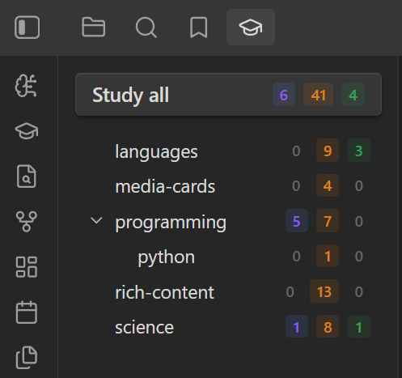

# Osmosis

**Absorb knowledge faster. An Obsidian plugin that turns your notes into interactive mind maps you study with spaced repetition.**

Osmosis turns your Markdown notes into interactive mind maps — and then makes the map itself the thing you study. Every line of a note can become a scheduled flashcard, so nodes on the map hide behind `?`, you tap to recall, and you rate with FSRS right where each fact sits in your knowledge structure. No duplicate content, no external tools, no proprietary formats.

[](https://www.gnu.org/licenses/gpl-3.0)
[](https://obsidian.md)


## Features

- **Study the Mind Map Itself** — Spatial study hides due nodes behind `?` placeholders while the rest of the map stays visible. Tap to recall, rate with FSRS, and never lose sight of how the fact connects to everything around it.
- **Your Whole Note Becomes Cards** — One command tags every heading, bullet, and paragraph with a block ID, turning the note into scheduled flashcards. No fences to write, no content to duplicate.
- **Interactive Mind Maps** — Your headings become branches, lists become nodes. Edit the map and the Markdown updates. Edit the Markdown and the map updates.
- **FSRS Spaced Repetition** — The same algorithm powering modern Anki, built right into your notes
- **Three Study Modes** — Spatial (on the mind map), contextual (inline in your notes), and sequential (classic card review) — all sharing one schedule
- **Five Card Types** — For hand-authored cards: basic Q&A, bidirectional, type-in, cloze deletion, and code cloze, all defined with a simple code fence syntax
- **Plain Markdown** — Everything lives in your files. Scheduling data is stored in note frontmatter and the fences themselves — no external databases, no sync issues
- **Themes and Styling** — Customize mind map appearance with built-in themes, colors, and layout options
- **Keyboard Navigation** — Full keyboard support for mind map editing and study sessions
- **Dashboard** — See all your decks, due card counts, and study statistics at a glance

## Why Osmosis?

Mind maps are great for *building* understanding and flashcards are great for *keeping* it — but every other tool makes you do those in two different apps, from two different copies of the same material. Osmosis collapses them: the map you built is the surface you study.

🧭 **Study on the map, not in a modal.** Start a spatial session and the nodes you owe a review hide behind `?` — everything else stays on screen. You recall each fact while looking at its parent, its siblings, and the branch it belongs to, so you're rehearsing the structure and the content at once. No other tool reviews cards inside the shape of your knowledge.

🌱 **No card authoring step.** Run **Generate flashcards from note** and every heading, bullet, and paragraph gets a native Obsidian block ID — that's the card. Write your notes the way you always have; the study material is already there. IDs survive edits, reorders, and renames, so scheduling history sticks to the line.

🗺️ **Not just a viewer — a full editor.** Tools like [Markmap](https://markmap.js.org/) render beautiful mind maps from Markdown, but they're read-only. Osmosis mind maps are fully interactive — add nodes, edit text, rearrange branches — and every change writes back to your Markdown instantly.

🔓 **Not proprietary — plain Markdown.** Tools like [Xmind](https://xmind.com/) are powerful mind mappers, but your data lives in a proprietary format. Markdown export is an afterthought. With Osmosis, Markdown *is* the format. Your notes work everywhere, with every tool, forever.

🤖 **AI-native by design.** Plain Markdown means AI assistants can read, generate, and edit your content natively — flashcards, mind maps, study material — no export, no conversion, no friction.

🧩 **Notes + mind maps + flashcards in one file.** Other tools force you to maintain these in separate apps. Osmosis unifies all three in a single Markdown file. Your headings become mind map branches, your lines become cards, and your `osmosis` code fences become hand-authored cards. One file, three views, zero duplication.

📝 **One card, everywhere you study it.** A node on the map, a line in your reading view, and an entry in the sequential queue are the same card with the same schedule. Review a branch on the map in the morning and those cards are gone from tonight's queue.

🔗 **Study a map of maps.** Embed one mind map inside another with `![[note]]` and build a master map of an entire subject. Embedded nodes are first-class in spatial study — they hide, reveal, and rate like local ones, and each rating is written back to the note that actually owns the line.

## Who It's For

**The Med Student** — You're drowning in anatomy, pharmacology, and pathology. You already use Anki, but maintaining two separate systems — notes and flashcards — is killing your workflow. Osmosis lets you define flashcards right inside your lecture notes, so your study material lives where you take notes. Mind maps help you see how body systems connect. FSRS keeps you on schedule.

**The Self-Taught Developer** — You're learning a new language, framework, or codebase on your own. Code cloze cards let you drill syntax and API patterns. Mind maps give you the big-picture architecture view. Everything stays in the same Markdown files you already take notes in.

**The Lifelong Learner** — You read books, watch lectures, and take notes — but forget most of it within weeks. Spaced repetition fixes that. With Osmosis the notes you already wrote *are* the cards: one command turns a note into a deck, and you review it on its own mind map. No separate app, no export step, no card-writing chore standing between reading and retaining.

**The Obsidian Power User** — You've built your second brain in Obsidian and you want mind mapping and spaced repetition without leaving the ecosystem. No proprietary formats, no external accounts, no sync issues. Plain Markdown, full ownership.

**The Visual Thinker** — Outlines and bullet points don't click for you. You need to see the structure, and a flashcard stripped out of its context is exactly the wrong format. Osmosis turns any Markdown file into an interactive mind map you can edit, rearrange, and review on — so recall happens at the position on the map where you learned it.

## Views

### Mind Map View


Your Markdown rendered as a fully interactive mind map:

- Headings become branches, lists become child nodes
- Click any node to edit — changes sync back to the Markdown instantly
- Pan, zoom, and navigate with keyboard shortcuts
- Multiple themes and color schemes
- Viewport culling for large documents (1000+ nodes)

### Spatial Study — Studying the Map Itself


Click the graduation cap in the mind map header and the map becomes a review session:

- Nodes whose card is **due or new** hide behind `?` — the rest of the map stays visible, because seeing how the pieces fit together is the point
- **Tap a hidden node** to reveal it, then rate it in the bubble below: Again (`1`), Hard (`2`), Good (`3`), Easy (`4`)
- A floating pill tracks progress (`4/9 due reviewed`) with a **Stop** button
- Right-click any node > **Study this branch** to scope the session to one subtree
- **Peek mode** (the scan-eye icon) hides every card node with nothing recorded — the map equivalent of covering the page with your hand
- Works in mind map reading mode, so a stray tap-drag on a phone can't rearrange a branch mid-review

### Flashcard View


Line cards from your notes and fence cards you author by hand share one queue and one scheduler. Fence cards come in five types:

- **Basic** — Question and answer
- **Bidirectional** — Study in both directions
- **Type-in** — Type your answer before revealing
- **Cloze** — Fill-in-the-blank with `==highlighted==` or `**bold**` markers
- **Code Cloze** — Cloze deletions inside code blocks

### Study Dashboard



Central hub for all your study sessions:

- Deck overview with due card counts
- Study statistics and progress tracking
- One-click access to sequential, contextual, or spatial study modes

## Quick Start

### Open a Mind Map

1. Open any Markdown file
2. Click the brain icon in the editor header (or use the command palette: **Open mind map view**)
3. Your headings and lists appear as an interactive mind map

### Turn the Note Into Cards

Run **Generate flashcards from note** from the command palette (or right-click the note > **Generate flashcards**). Osmosis previews every line it will tag, then writes block IDs in a single undoable edit:

```markdown
- Pour water at 96 °C in slow circles ^os-a1b2c3
```

Each tagged line is now an FSRS-scheduled card. Re-running the command is incremental — existing IDs and their history are left alone.

### Study on the Map

1. Open the mind map for that note
2. Click the graduation cap icon in the mind map header
3. Due and new nodes hide behind `?` — tap one to reveal it, then rate it

Ratings are saved to the note's `osmosis-schedule` frontmatter, so the schedule travels with the note.

### Add a Hand-Authored Card

For a question that isn't just a line of your notes, add an `osmosis` code fence:

````markdown
```osmosis
Which brew method uses full immersion?
***
French press
```
````

### Enable Cards for a Note

Add `osmosis-cards: true` to your note's frontmatter:

```yaml
---
osmosis-cards: true
---
```

Or configure tag/folder-based inclusion in Settings > Osmosis. (Generating flashcards adds this for you.)

### Study Everything Else

Click the graduation cap icon in the sidebar to open the Dashboard. It shows your decks and due card counts across the vault. Click any deck to start a sequential session.

## Card Syntax

Line cards need no syntax — they're just your notes with block IDs. The card types below are for hand-authored cards, and all use the `osmosis` code fence with `***` as the separator.

### Basic Card

````markdown
```osmosis
What is the powerhouse of the cell?
***
The mitochondria
```
````

### Bidirectional Card

````markdown
```osmosis
bidi: true

Mitochondria
***
The powerhouse of the cell
```
````

### Type-in Card

````markdown
```osmosis
type-in: true

The powerhouse of the cell is the ___
***
mitochondria
```
````

### Cloze Card

Use `==highlights==` or `**bold**` to mark deletions. Each marked term generates a separate card.

````markdown
```osmosis
==Mitochondria== are the ==powerhouse== of the ==cell==
```
````

### Code Cloze Card

Use `osmosis-cloze` in a comment to mark lines for deletion. Use `osmosis-cloze-start` / `osmosis-cloze-end` for multi-line regions.

`````markdown
````osmosis
```python
def fibonacci(n):
    if n <= 1:
        return n  # osmosis-cloze
    return fibonacci(n-1) + fibonacci(n-2)
```
````
`````

## Installation

### From Community Plugins

1. Open **Settings** > **Community Plugins**
2. Click **Browse** and search for "Osmosis"
3. Click **Install**, then **Enable**

### Manual Installation

1. Download `main.js`, `styles.css`, and `manifest.json` from the [latest release](https://github.com/SawyerRensel/Osmosis/releases/latest)
2. Copy them into your vault's `.obsidian/plugins/osmosis/` directory, creating it if needed
3. Reload Obsidian, then enable Osmosis in **Settings** > **Community Plugins**

## Technology Stack

| Component | Technology |
|-----------|------------|
| Language | TypeScript |
| Platform | Obsidian Plugin API |
| Spaced Repetition | [FSRS](https://github.com/open-spaced-repetition/ts-fsrs) |
| Testing | Vitest (unit), Playwright (E2E) |
| Linting | ESLint with obsidianmd plugin |

## Documentation

Full documentation is available at **[sawyerrensel.github.io/Osmosis](https://sawyerrensel.github.io/Osmosis/)**:

- **Getting Started** — [Installation](https://sawyerrensel.github.io/Osmosis/getting-started/installation/) · [Quick Start](https://sawyerrensel.github.io/Osmosis/getting-started/quick-start/)
- **Mind Mapping** — [Editing](https://sawyerrensel.github.io/Osmosis/mind-mapping/editing/) · [Navigation](https://sawyerrensel.github.io/Osmosis/mind-mapping/navigation/) · [Styling](https://sawyerrensel.github.io/Osmosis/mind-mapping/styling/)
- **Flashcards** — [Line Cards](https://sawyerrensel.github.io/Osmosis/flashcards/line-cards/) · [Card Types](https://sawyerrensel.github.io/Osmosis/flashcards/card-types/) · [Decks](https://sawyerrensel.github.io/Osmosis/flashcards/decks/)
- **Studying** — [Spaced Repetition](https://sawyerrensel.github.io/Osmosis/studying/spaced-repetition/) · [Study Modes](https://sawyerrensel.github.io/Osmosis/studying/study-modes/)

## Development

```bash
# Clone the repository
git clone https://github.com/SawyerRensel/Osmosis.git
cd Osmosis

# Install dependencies
npm install

# Build for development (watches for changes)
npm run dev

# Build for production
npm run build
```

Build output goes to `vault/.obsidian/plugins/Osmosis/` for testing.

## Contributing

Contributions are welcome! Please:

1. Fork the repository
2. Create a feature branch (`git checkout -b feature/amazing-feature`)
3. Commit your changes (`git commit -m 'Add amazing feature'`)
4. Push to the branch (`git push origin feature/amazing-feature`)
5. Open a Pull Request

## License

This project is licensed under the GNU General Public License v3.0 — see the [LICENSE](LICENSE) file for details.

## Acknowledgments

- [Obsidian](https://obsidian.md) — The incredible knowledge base application
- [FSRS](https://github.com/open-spaced-repetition/ts-fsrs) — Free Spaced Repetition Scheduler
- [Anki](https://apps.ankiweb.net/) — Inspiration for spaced repetition workflows
- [Xmind](https://xmind.com/) — Inspiration for mind mapping UX
- [Minder](https://github.com/phase1geo/Minder) — Open-source mind mapping software
- [obsidian-spaced-repetition](https://github.com/st3v3nmw/obsidian-spaced-repetition) — The original Obsidian spaced repetition plugin
- [Decks](https://github.com/pheralb/decks) — Modern flashcard plugin for Obsidian using FSRS

---

**Author:** Sawyer Rensel ([@SawyerRensel](https://github.com/SawyerRensel))
