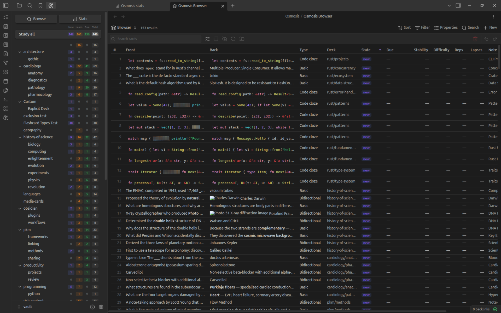

# Card Browser

The Osmosis Browser is every card in your vault in one list — fences, line
cards, clozes, occlusions and all — with the scheduling controls you would
expect: suspend, reset, change deck, delete.

Open it with the :lucide-search: **Browse** button on the [dashboard](index.md),
or run **Open card browser** from the command palette.

!!! info "The browser is a Bases view"
    Browse opens a `.base` file (`Osmosis/Osmosis Browser.base`, created on first
    use) rather than a bespoke panel. That means Bases' own **Filter**, **Sort**
    and grouping menus work on the *notes* your cards live in, while every
    card-level control lives in the view's own toolbar and in the view options
    panel. Bases is an Obsidian core plugin — if it's turned off, Browse says so
    instead of opening. You can also add the **Osmosis Cards** view to any base
    of your own.

## Layouts

Set **Card layout** in the view options:

| Layout | Best for |
|--------|----------|
| **Table** | Scanning and sorting a lot of cards; twelve columns, resizable and sortable |
| **Cards** | Reading fronts and backs as rendered markdown, with a **Card height** slider |

Table columns: Front, Back, Type, Deck, State, Due, Stability, Difficulty, Reps,
Lapses, Note, ID. Drag a column edge to resize it, double-click a grip to reset
every column, and click a header to sort (click again to reverse).

Fronts and backs render as real markdown — images, embeds, LaTeX and code
included — and render lazily as you scroll.

## Filtering

Card-level filters live in the view options panel:

| Option | Values |
|--------|--------|
| **Card state** | All, New, Learning, Review, Relearning |
| **Due within** | Any, Overdue, Today, Next 7 days, Next 30 days |
| **Card types** | One toggle each for Basic, Bidirectional, Cloze, Code cloze, Occlusion, Line |
| **Sort cards by** | Base order, Due, State, Stability, Difficulty, Reps, Lapses, Note, Deck |
| **Show suspended cards** | Off by default |

The **search box** in the toolbar matches front, back, deck, and card ID. It's
applied on ++enter++ or when the box loses focus.

!!! tip "Unchecking every card type shows everything"
    An empty type selection means "no constraint", not "nothing" — so a blank
    panel is never what you get.

Bases' **Filter** menu still works, one level up: use it to narrow to a folder,
a tag, or any note property, then use the view's own controls to narrow to
cards within those notes. Grouping from Bases renders as an outer level above
the browser's own note grouping.

## Selecting Cards

| Input | Action |
|-------|--------|
| Click a row | Select it |
| ++ctrl++ / ++cmd++ + click | Add or remove one row |
| ++shift++ + click | Select a range |
| Select all button | Every card currently listed |
| ++escape++ | Deselect |
| Long-press (touch) | Start a selection on mobile |

## Mutations

With a selection, the toolbar's icon buttons act on it. Every button stays
visible and dims when it can't apply, so nothing moves under your finger.

| Action | What it does |
|--------|--------------|
| :lucide-eye-off: **Suspend / Unsuspend** | Takes cards out of study, keeping their history |
| :lucide-refresh-cw: **Reset** | Clears FSRS scheduling and returns cards to new. Review history is kept |
| :lucide-folder-input: **Change deck** | Writes `osmosis-deck` to the cards' notes |
| :lucide-trash-2: **Delete** | Removes the cards from your notes, behind a confirmation |
| :lucide-undo-2: / :lucide-redo-2: **Undo / Redo** | Steps back through this session's mutations |

**Delete removes the card, not your prose.** A fence card *is* its fence, so the
fence goes. A line card is deleted by stripping its `^os-` block ID — the line
itself stays exactly as you wrote it.

### Fence metadata is per-fence

A bidirectional fence produces two cards and a cloze fence produces one per
group, but the fence carries a single `exclude:` key. So:

- **Suspend takes the whole fence's cards along**, deliberately, and the result
  message tells you how many came with it.
- **Reset is per-card**: resetting one cloze group leaves its siblings' schedules
  untouched.

### Undo

Undo and redo are **session-only** and snapshot-based — they're gone when
Obsidian restarts, and they refuse wholesale if a file changed after the
mutation. Delete is therefore reversible within a session, but the confirmation
modal stays regardless. The commands **Undo last card mutation** and **Redo last
undone card mutation** are bindable to hotkeys.

## What It Doesn't Do

- **No inline editing of fronts and backs.** Cards are text in your notes; open
  the note to change what a card asks.
- **Bases' Properties menu is inert here.** It lists *note* properties, and the
  browser's columns are card fields.
- **Suspending a single card of a multi-card fence** would need a change to the
  fence format. Suspend the fence, or split the card out.
