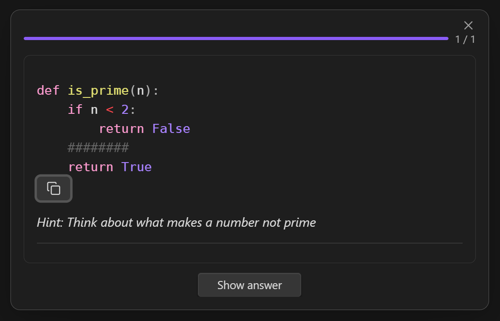
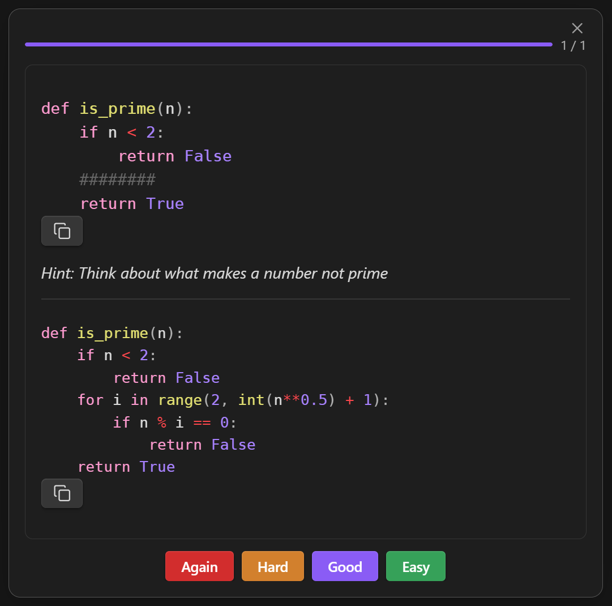

# Card Types

## Basic (Front / Back)

The simplest card. Front and back separated by `***`:

````markdown
```osmosis
What is the powerhouse of the cell?
***
The mitochondria
```
````

Both front and back support full markdown — bold, italic, code, images, LaTeX.


## Bidirectional

Generates two cards, one in each direction. Add `bidi: true`:

````markdown
```osmosis
bidi: true

Bonjour
***
Hello
```
````

This creates:

- **Forward**: "Bonjour" :octicons-arrow-right-16: "Hello"
- **Reverse**: "Hello" :octicons-arrow-right-16: "Bonjour"

Each direction is scheduled independently.

## Type-In

Requires you to type the answer instead of flipping the card. Add `type-in: true`:

````markdown
```osmosis
type-in: true

Spell the French word for "hello"
***
Bonjour
```
````

You can combine both flags for bidirectional type-in cards:

````markdown
```osmosis
bidi: true
type-in: true

Bonjour
***
Hello
```
````

## Cloze Deletion

Blank out terms in a sentence using `==term==` or `**term**` markers:

````markdown
```osmosis
==Mitochondria== are the ==powerhouse== of the ==cell==
```
````

This generates **three cards**, one per deletion:

| Card | Front |
|------|-------|
| 1 | `________` are the ==powerhouse== of the ==cell== |
| 2 | ==Mitochondria== are the `________` of the ==cell== |
| 3 | ==Mitochondria== are the ==powerhouse== of the `________` |

Each card blanks one term while leaving the others visible. All cards share the same back: the full text.

!!! note
    No `***` separator is needed for cloze cards. If you include one, the cloze markers are ignored and the fence is treated as a basic front/back card.

## Code Cloze

Blank out lines of code using comment annotations. Works with any programming language.

### Single Line

Add `osmosis-cloze` in a comment at the end of the line:

`````markdown
````osmosis
```python
def greet(name):
    return f"Hello, {name}"  # osmosis-cloze
```
````
`````

The marked line shows as `________` on the front (preserving indentation). The comment marker is stripped from the back.





### Multi-Line Region

Wrap a region with `osmosis-cloze-start` and `osmosis-cloze-end`:

`````markdown
````osmosis
```python
def fibonacci(n):
    if n <= 1:
        return n
    # osmosis-cloze-start
    a, b = 0, 1
    for _ in range(2, n + 1):
        a, b = b, a + b
    return b
    # osmosis-cloze-end
```
````
`````

The entire region becomes a single `________` on the front. Marker lines are removed from both front and back.

### Multiple Regions

You can mix single-line and multi-line markers in the same fence. Each region becomes a separate card:

`````markdown
````osmosis
```python
def fibonacci(n):
    if n <= 1:
        return n  # osmosis-cloze
    # osmosis-cloze-start
    a, b = 0, 1
    for _ in range(2, n + 1):
        a, b = b, a + b
    return b
    # osmosis-cloze-end
```
````
`````

This generates two cards — one blanking the `return n` line, and one blanking the loop body.

### Supported Comment Styles

The `osmosis-cloze` marker works with any comment syntax:

| Language | Syntax |
|----------|--------|
| Python, Ruby, Shell | `# osmosis-cloze` |
| JavaScript, Java, C, Rust, Go | `// osmosis-cloze` |
| SQL | `-- osmosis-cloze` |
| CSS, C (block) | `/* osmosis-cloze */` |
| HTML, XML | `<!-- osmosis-cloze -->` |

!!! tip "Nesting code fences"
    When your card contains a code fence, use **four backticks** for the outer `osmosis` fence so the inner fence closes properly.

## Inserting Cards via Command Palette

Use the command palette for quick card insertion:

| Command | Inserts |
|---------|---------|
| Insert basic card | Front/back template |
| Insert bidirectional card | With `bidi: true` |
| Insert type-in card | With `type-in: true` |
| Insert bidirectional type-in card | Both flags |
