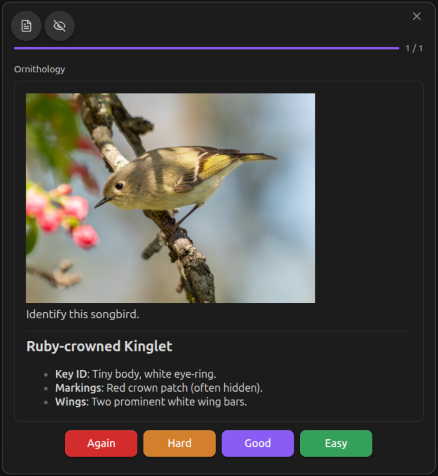

# Card Types

Five card types come out of the same `osmosis` fence, plus
[image occlusion](image-occlusion.md) from an image's context menu and
[line cards](line-cards.md) from the note's own lines.

**Every type studies in every mode.** A fence that fans out into three cloze
cards asks three questions and takes three ratings whether you meet it in the
[sequential modal](../studying/study-modes.md#sequential-study), in the
[note](../studying/study-modes.md#contextual-study), or on the
[mind map](../studying/study-modes.md#spatial-study).

## Basic (Front / Back)

The simplest card. Front and back separated by `***`:

{width=66%}

````markdown
```osmosis
What does HTTP 429 mean?
***
Too Many Requests — back off and retry later
```
````

Both front and back support full markdown — bold, italic, code, images, LaTeX.

## Bidirectional

Generates two cards, one in each direction. Add `bidi: true`:

{width=66%}

````markdown
```osmosis
bidi: true

Bonjour
***
Hello
```
````

This creates:

- **Forward**: "Bonjour" :octicons-arrow-right-16: "Hello"
- **Reverse**: "Hello" :octicons-arrow-right-16: "Bonjour"

Each direction is scheduled independently.

## Type-In

Requires you to type the answer instead of flipping the card. Add `type-in: true`:

{width=66%}

````markdown
```osmosis
type-in: true

Spell the French word for "hello"
***
Bonjour
```
````

You can combine both flags for bidirectional type-in cards:

````markdown
```osmosis
bidi: true
type-in: true

Bonjour
***
Hello
```
````

## Cloze Deletion

Blank out terms in a sentence using `==term==`, `**term**`, or `:::term:::` markers:

{width=66%}

````markdown
```osmosis
The ==Treaty of Versailles== was signed in ==1919==, ending ==World War I==
```
````

This generates **three cards**, one per deletion:

| Card | Front |
|------|-------|
| 1 | The `________` was signed in ==1919==, ending ==World War I== |
| 2 | The ==Treaty of Versailles== was signed in `________`, ending ==World War I== |
| 3 | The ==Treaty of Versailles== was signed in ==1919==, ending `________` |

Each card blanks one term while leaving the others visible. All cards share the same back: the full text.

All three delimiter styles are interchangeable, so pick whichever reads best alongside your prose:

- `==term==` — Obsidian-style highlight; the yellow mark survives on the back.
- `**term**` — bold; same idea if you prefer bold emphasis.
- `:::term:::` — plain. Markers are stripped from both sides, leaving no visual residue.

!!! note
    No `***` separator is needed for cloze cards. If you include one, the cloze markers are ignored and the fence is treated as a basic front/back card.

### Grouping clozes

Prefix any marker with `c<N>:` to blank several terms together as a single card. Occurrences that share a number are revealed together.

````markdown
```osmosis
==c1:Paris== is the capital of France, and ==c1:Paris== sits on the Seine.
```
````

This produces **one card** (not two) with both occurrences of "Paris" blanked at once.

Grouping works with any combination of delimiters — `==c1:…==`, `**c1:…**`, and `:::c1:…:::` with the same number all collapse to one card.

User-chosen numbers are preserved verbatim on card IDs (`…-c1`, `…-c5`), so adding a new cloze later won't renumber existing cards. Unlabeled markers get numbers above the largest labeled one, in source order.

## Code Cloze

Blank out lines of code using comment annotations. Works with any programming language.

{width=66%}


### Single Line

Add `osmosis-cloze` in a comment at the end of the line:

`````markdown
````osmosis
```python
def greet(name):
    return f"Hello, {name}"  # osmosis-cloze
```
````
`````

The marked line shows as `________` on the front (preserving indentation). The comment marker is stripped from the back.

### Multi-Line Region

Wrap a region with `osmosis-cloze-start` and `osmosis-cloze-end`:

`````markdown
````osmosis
```python
def fibonacci(n):
    if n <= 1:
        return n
    # osmosis-cloze-start
    a, b = 0, 1
    for _ in range(2, n + 1):
        a, b = b, a + b
    return b
    # osmosis-cloze-end
```
````
`````

The entire region becomes a single `________` on the front. Marker lines are removed from both front and back.

### Multiple Regions

You can mix single-line and multi-line markers in the same fence. Each region becomes a separate card:

`````markdown
````osmosis
```python
def fibonacci(n):
    if n <= 1:
        return n  # osmosis-cloze
    # osmosis-cloze-start
    a, b = 0, 1
    for _ in range(2, n + 1):
        a, b = b, a + b
    return b
    # osmosis-cloze-end
```
````
`````

This generates two cards — one blanking the `return n` line, and one blanking the loop body.

### Inline Clozes

Blank out individual tokens *inside* a line of code with `:::c<N>:text:::`, where `N` is a group number:

`````markdown
````osmosis
```python
def :::c1:greet:::(:::c2:name:::):
    return f"Hello, :::c2:name:::"
```
````
`````

Each distinct group number becomes its own card. Tokens that share a number are blanked together and revealed together — useful when the same identifier appears in several places.

The example above generates **two cards**:

| Card | Front |
|------|-------|
| 1 | `def ░░░░░░░░(name):` … `return f"Hello, name"` |
| 2 | `def greet(░░░░░░░░):` … `return f"Hello, ░░░░░░░░"` |

On every card, markers from *other* groups are stripped to plain text, so only the targeted tokens are obfuscated.

You can also omit the number — `:::text:::` — to make each occurrence its own one-off card without grouping.

### Grouping line-level and multi-line code clozes

Line and region markers accept the same `-c<N>` suffix. Any markers that share a number collapse into a single card:

`````markdown
````osmosis
```python
x = 1  # osmosis-cloze-c1
# osmosis-cloze-start-c1
y = compute()
z = y + 1
# osmosis-cloze-end-c1
result = x + z
```
````
`````

This generates **one card** with all three hidden lines blanked together and `result = x + z` visible.

### Mixing prose and code clozes in one fence

Prose-level and code-level clozes live happily inside the same `osmosis` fence. Markers sharing a `c<N>` label across prose and code still merge into a single card:

`````markdown
````osmosis

This is a regular :::c3:cloze:::.

```python
def :::c1:greet:::(:::c2:name:::):
    return f"Hello, :::c2:name:::"
```
````
`````

This produces three cards:

- `c1`: `greet` blanked in the code; prose visible.
- `c2`: both `name` occurrences blanked together; prose visible.
- `c3`: the prose cloze blanked; the code visible.

!!! tip "Combining with line-level clozes"
    Inline and line-level markers can coexist in the same code block. Lines covered by `osmosis-cloze` / `osmosis-cloze-start`…`osmosis-cloze-end` are blanked as whole-line cards; their inline `:::…:::` markers, if any, are ignored.

### Supported Comment Styles

The `osmosis-cloze` marker works with any comment syntax:

| Language | Syntax |
|----------|--------|
| Python, Ruby, Shell | `# osmosis-cloze` |
| JavaScript, Java, C, Rust, Go | `// osmosis-cloze` |
| SQL | `-- osmosis-cloze` |
| CSS, C (block) | `/* osmosis-cloze */` |
| HTML, XML | `<!-- osmosis-cloze -->` |

!!! tip "Nesting code fences"
    When your card contains a code fence, use **four backticks** for the outer `osmosis` fence so the inner fence closes properly.

## Image Occlusion

Right-click an image and choose **Create image occlusion** to draw masks over it. Each group of masks is one card, scheduled like a cloze deletion. See [Image Occlusion](image-occlusion.md).

{width=66%}

## Line Cards

Line cards turn a whole note - or a part of a note - into flashcards. **Every line becomes its own scheduled card**, with no fences and no duplicate authoring. See [Line Cards](line-cards.md).

{width=66%}

## Inserting Cards via Command Palette

Use the command palette for quick card insertion:

| Command | Inserts |
|---------|---------|
| Insert basic card | Front/back template |
| Insert bidirectional card | With `bidi: true` |
| Insert type-in card | With `type-in: true` |
| Insert bidirectional type-in card | Both flags |

Each of these also adds `osmosis-cards: true` to the note if it isn't opted in
yet, so an inserted card is a real card immediately.

For typing several cards in a row — especially on a phone — turn on
[Rapid Flashcard Mode](rapid-capture.md) instead and let blank lines do the
work.
