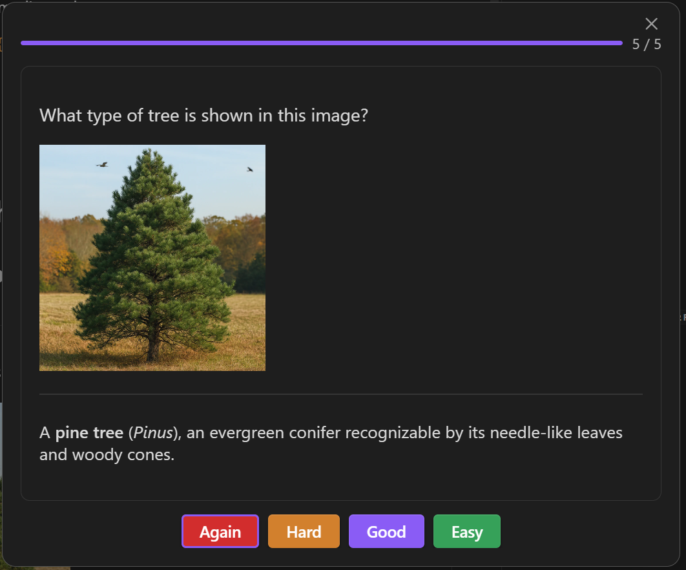

# Flashcards

Osmosis flashcards live directly in your markdown files as `osmosis` code fences. No external database, no sync issues — your cards travel with your notes.



## Enabling Cards

A note must opt in to card generation. Three ways:

### Frontmatter

```yaml
---
osmosis-cards: true
---
```

### Folder Inclusion

In **Settings > Osmosis > Include folders**, add folder paths. All notes in those folders will generate cards automatically.

### Tag Inclusion

In **Settings > Osmosis > Include tags**, add tags. All notes with those tags will generate cards automatically.

## Your First Card

Add an `osmosis` code fence to any opted-in note:

````markdown
```osmosis
What is the capital of France?
***
Paris
```
````

The `***` separator divides the front (question) from the back (answer).

## Metadata

Add optional metadata at the top of the fence, before a blank line:

````markdown
```osmosis
id: french-capital
deck: geography/europe
hint: Western Europe

What is the capital of France?
***
Paris
```
````

| Field | Description | Default |
|-------|-------------|---------|
| `id` | Stable card identifier | Auto-generated |
| `bidi` | Generate a reverse card too | `false` |
| `type-in` | Require typed answer | `false` |
| `deck` | Override deck assignment | From folder/frontmatter |
| `hint` | Shown on the front as a hint | — |
| `exclude` | Skip this fence for card generation | `false` |

## Scheduling Data

After you review a card, Osmosis writes scheduling fields (`due`, `stability`, `difficulty`, `reps`, `lapses`, `state`, `last-review`) back into the fence metadata. These are managed by the FSRS algorithm — don't edit them manually.

## Guides

<div class="grid cards" markdown>

-   [:octicons-note-24: __Card Types__](card-types.md)

    Basic, bidirectional, type-in, cloze, and code cloze cards with examples

-   [:octicons-stack-24: __Decks__](decks.md)

    Organizing cards into decks by folder, frontmatter, or per-card override

</div>
