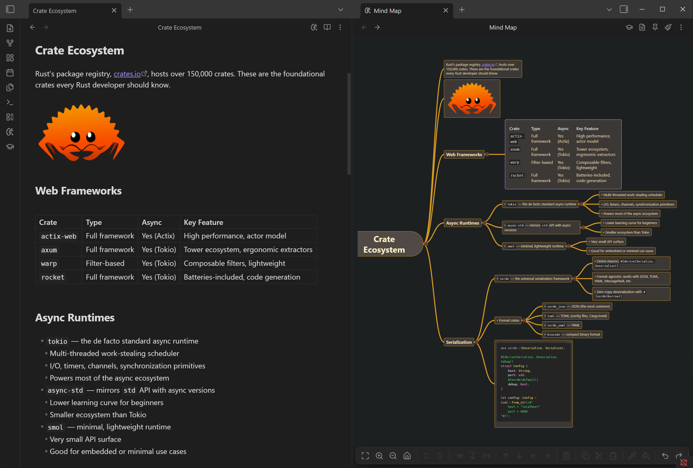

# Quick Start

## Open a Mind Map

1. Open any markdown file in your vault
2. Click the :lucide-brain-circuit: icon in the editor header bar (next to the reading view toggle)
3. Your headings and lists appear as an interactive mind map




You can also open a mind map from:

- **Command palette** — "Open mind map view"
- **File menu** — Right-click a file, select "Mind map view"
- **Ribbon** — Click the :lucide-brain-circuit: icon in the left sidebar

## Create a Flashcard

Add an `osmosis` code fence anywhere in a markdown file:

````markdown
```osmosis
What is the powerhouse of the cell?
***
The mitochondria
```
````

The `***` separator divides the front (question) from the back (answer).

## Enable Cards for a Note

Cards aren't generated unless you opt in. Add this to your note's frontmatter:

```yaml
---
osmosis-cards: true
---
```

Or configure automatic inclusion by folder or tag in **Settings > Osmosis**.

## Start Studying

1. Click the :lucide-graduation-cap: icon in the left sidebar to open the **Dashboard**
2. Your decks appear with card counts: new (blue), learning (orange), due (red)
3. Click a deck to start a study session


!!! tip "Three study modes"
    - **Sequential** — Classic Anki-style card review (from the Dashboard)
    - **Contextual** — Study cards inline while reading your notes
    - **Spatial** — Study on the mind map by clicking the :lucide-graduation-cap: icon in the mind map header

## What's Next?

- Learn the full set of [mind map editing and navigation shortcuts](../mind-mapping/editing.md)
- Explore all [card types](../flashcards/card-types.md) including cloze deletions and code cloze
- Customize your maps with [themes and styling](../mind-mapping/styling.md)
