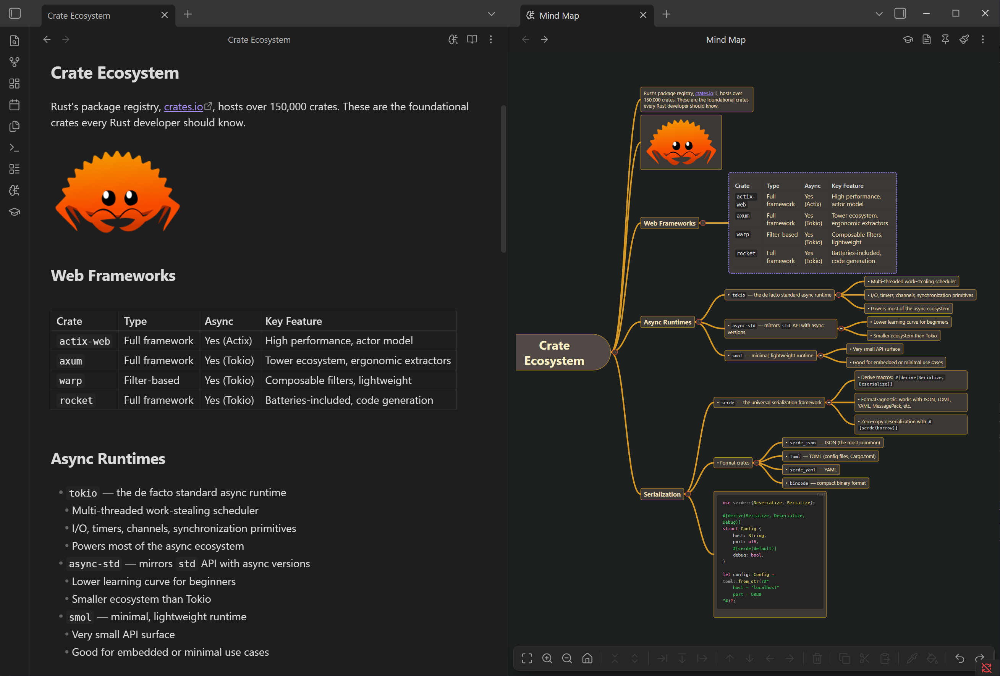

# Quick Start

## Open a Mind Map

1. Open any markdown file in your vault
2. Click the :lucide-brain-circuit: icon in the editor header bar (next to the reading view toggle)
3. Your headings and lists appear as an interactive mind map




You can also open a mind map from:

- **Command palette** — "Open mind map view"
- **File menu** — Right-click a file, select "Mind map view"

Drag a branch somewhere new and your Markdown updates immediately. Edit the
Markdown and the map follows.

## Create a Flashcard

Add an `osmosis` code fence anywhere in a markdown file:

````markdown
```osmosis
What does HTTP 429 mean?
***
Too Many Requests — back off and retry later
```
````

The `***` separator divides the front (question) from the back (answer).

There are quicker ways once you're settled in:

| Way in | Good for |
|--------|----------|
| **Insert basic card** in the command palette | One card, right here |
| [Rapid Flashcard Mode](../flashcards/rapid-capture.md) | Typing a run of cards, especially on a phone |
| [Generate flashcards from note](../flashcards/line-cards.md) | Turning a note you already wrote into cards |
| [Create image occlusion](../flashcards/image-occlusion.md) | Anything visual — right-click an image |

## Enable Cards for a Note

Cards aren't generated unless the note opts in:

```yaml
---
osmosis-cards: true
---
```

The card-insertion commands, Rapid Flashcard Mode, and the occlusion editor add
this for you. You can also opt in whole folders or tags under
**Settings > Osmosis**.

## Start Studying

1. Click the :lucide-brain-circuit: icon in the left ribbon to open the **Osmosis dashboard**
2. Your decks appear with counts: new, learning, due, and the total waiting now
3. Click a deck to start a study session — or **Study all**


!!! tip "Three study modes"
    - **Sequential** — classic card-by-card review, from the dashboard
    - **Contextual** — study in the note, with the :lucide-graduation-cap: **Study** action in the note's header
    - **Spatial** — study on the mind map, with the :lucide-graduation-cap: icon in the mind map header

    Every card type works in every mode, and a card rated anywhere updates its
    schedule everywhere.

## What's Next?

- Learn the full set of [mind map editing and navigation shortcuts](../mind-mapping/editing.md)
- Explore all [card types](../flashcards/card-types.md), including cloze deletions, code cloze, and [image occlusion](../flashcards/image-occlusion.md)
- Customize your maps with [themes and styling](../mind-mapping/styling.md)
- Watch your progress on the [statistics dashboard](../dashboard/statistics.md)
