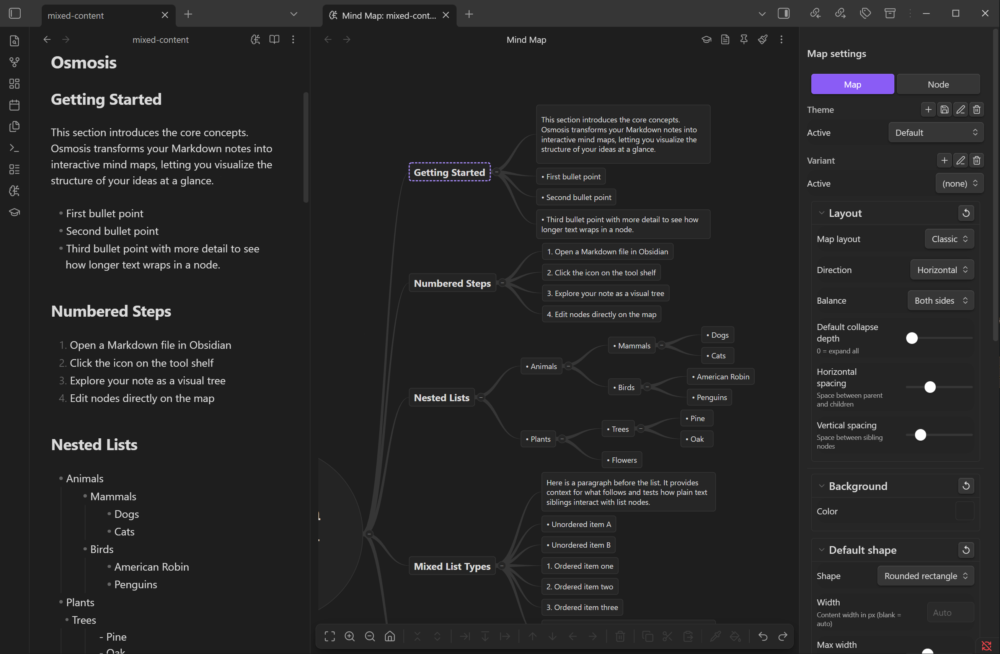
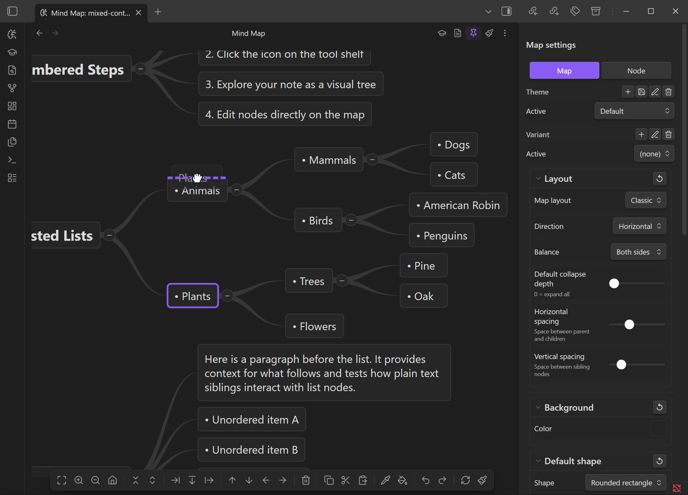

<div class="osmosis-home">

<!-- ===================== Hero ===================== -->
<section class="osmosis-hero">
  <h1>Map your mind. Build your memory.</h1>
  <p class="osmosis-hero__sub">
    Absorb information faster and longer with unified notes, flashcards, and mind maps.
  </p>
  <div class="osmosis-hero__actions">
    <a class="osmosis-btn osmosis-btn--primary" href="getting-started/installation/">Install Osmosis</a>
    <a class="osmosis-btn osmosis-btn--ghost" href="getting-started/quick-start/">Quick start &rarr;</a>
  </div>
  <p class="osmosis-hero__note">Free and open source &middot; GPL-3.0 &middot; Requires Obsidian 1.13+</p>
  <div class="osmosis-hero__media">
    <!-- MEDIA SWAP: replace with video V1 (note ↔ map two-way edit loop) -->
    
  </div>
</section>

<!-- ===================== Story 1 — mind maps ===================== -->
<section class="osmosis-story">
  <div class="osmosis-story__copy">
    <p class="osmosis-home__eyebrow">Mind maps</p>
    <h2>Your notes, as a map you can edit.</h2>
    <p class="osmosis-story__body">
      Headings become branches. Lists become nodes. Drag a branch somewhere new
      and your Markdown updates immediately — edit the Markdown and the map
      follows.
    </p>
    <p class="osmosis-story__body">
      Other tools render Markdown into a mind map and stop there. Osmosis
      writes back.
    </p>
    <a class="osmosis-story__link" href="mind-mapping/">Explore mind mapping &rarr;</a>
  </div>
  <div class="osmosis-story__media">
    <!-- MEDIA SWAP: replace with video V2 (add node, drag branch, fold subtree) -->
    
  </div>
</section>

<!-- ===================== Story 2 — flashcards ===================== -->
<section class="osmosis-story osmosis-story--reverse">
  <div class="osmosis-story__copy">
    <p class="osmosis-home__eyebrow">Flashcards</p>
    <h2>Cards that live in your notes.</h2>
    <p class="osmosis-story__body">
      Write a card in an <code>osmosis</code> fence wherever the idea comes up.
      Basic, bidirectional, type-in, cloze, and code cloze — one syntax, five
      card types, no separate app.
    </p>
    <p class="osmosis-story__body">
      Or turn every line of a note into its own scheduled card with a single
      command, anchored by native block IDs. Nothing gets authored twice.
    </p>
    <a class="osmosis-story__link" href="flashcards/card-types/">See the card types &rarr;</a>
  </div>
  <div class="osmosis-story__media">
    <!-- MEDIA SWAP: replace with video V3 (fence → review → flip → grade) -->
    
  </div>
</section>

<!-- ===================== Story 3 — study modes ===================== -->
<section class="osmosis-story">
  <div class="osmosis-story__copy">
    <p class="osmosis-home__eyebrow">Study modes</p>
    <h2>Study where the knowledge lives.</h2>
    <p class="osmosis-story__body">
      Sequential review when you want classic drilling. Contextual review to
      study inline, surrounded by your own explanations and examples.
    </p>
    <p class="osmosis-story__body">
      And spatial review — answer cards on the mind map itself, so you see how
      each fact connects to everything around it while you recall it.
    </p>
    <a class="osmosis-story__link" href="studying/study-modes/">Compare study modes &rarr;</a>
  </div>
  <div class="osmosis-story__media">
    <!-- MEDIA SWAP: replace with video V4 (spatial study: reveal + grade) -->
    
  </div>
</section>

<!-- ===================== Story 4 — plain Markdown ===================== -->
<section class="osmosis-story osmosis-story--reverse">
  <div class="osmosis-story__copy">
    <p class="osmosis-home__eyebrow">Your data</p>
    <h2>Plain Markdown. Forever.</h2>
    <p class="osmosis-story__body">
      Cards, scheduling state, and map styling all live in the note — in the
      fence and the frontmatter. No database, no account, no proprietary file
      format.
    </p>
    <p class="osmosis-story__body">
      Your vault syncs the way it always has. And because it is only ever text,
      an AI assistant can read and write your study material natively.
    </p>
    <a class="osmosis-story__link" href="flashcards/">How cards are stored &rarr;</a>
  </div>
  <div class="osmosis-story__media">

````markdown
## Ownership and borrowing

- Each value has exactly one owner ^b3f1a2

```osmosis
type: basic
Q: What happens when an owner goes out of scope?
A: The value is dropped and its memory freed.
due: 2026-08-02
stability: 12.4
```
````

  </div>
</section>

<!-- ===================== Feature grid ===================== -->
<section class="osmosis-features">
  <div class="osmosis-home__inner">
    <h2>Discover more</h2>
    <ul class="osmosis-features__grid">
      <li>
        <svg xmlns="http://www.w3.org/2000/svg" viewBox="0 0 24 24" fill="none" stroke="currentColor" stroke-width="2" stroke-linecap="round" stroke-linejoin="round" aria-hidden="true"><path d="m17 2 4 4-4 4"/><path d="M3 11v-1a4 4 0 0 1 4-4h14"/><path d="m7 22-4-4 4-4"/><path d="M21 13v1a4 4 0 0 1-4 4H3"/></svg>
        <h3>FSRS scheduling</h3>
        <p>The algorithm behind modern Anki, scheduling every card in your vault.</p>
      </li>
      <li>
        <svg xmlns="http://www.w3.org/2000/svg" viewBox="0 0 24 24" fill="none" stroke="currentColor" stroke-width="2" stroke-linecap="round" stroke-linejoin="round" aria-hidden="true"><circle cx="13.5" cy="6.5" r=".5" fill="currentColor"/><circle cx="17.5" cy="10.5" r=".5" fill="currentColor"/><circle cx="8.5" cy="7.5" r=".5" fill="currentColor"/><circle cx="6.5" cy="12.5" r=".5" fill="currentColor"/><path d="M12 2a10 10 0 0 0 0 20 2 2 0 0 0 2-2v-1a2 2 0 0 1 2-2h2a4 4 0 0 0 4-4 10 10 0 0 0-10-9z"/></svg>
        <h3>Themes and styling</h3>
        <p>Built-in map themes plus per-node colors, shapes, and layout controls.</p>
      </li>
      <li>
        <svg xmlns="http://www.w3.org/2000/svg" viewBox="0 0 24 24" fill="none" stroke="currentColor" stroke-width="2" stroke-linecap="round" stroke-linejoin="round" aria-hidden="true"><path d="M12 7v14"/><path d="M3 18a1 1 0 0 1-1-1V4a1 1 0 0 1 1-1h5a4 4 0 0 1 4 4 4 4 0 0 1 4-4h5a1 1 0 0 1 1 1v13a1 1 0 0 1-1 1h-6a3 3 0 0 0-3 3 3 3 0 0 0-3-3z"/></svg>
        <h3>Reading mode</h3>
        <p>Flip a map read-only. Pan, zoom, fold, and study still work; nothing moves by accident.</p>
      </li>
      <li>
        <svg xmlns="http://www.w3.org/2000/svg" viewBox="0 0 24 24" fill="none" stroke="currentColor" stroke-width="2" stroke-linecap="round" stroke-linejoin="round" aria-hidden="true"><rect width="20" height="16" x="2" y="4" rx="2"/><path d="M6 8h.001"/><path d="M10 8h.001"/><path d="M14 8h.001"/><path d="M18 8h.001"/><path d="M6 12h.001"/><path d="M18 12h.001"/><path d="M10 12h4"/><path d="M7 16h10"/></svg>
        <h3>Keyboard navigation</h3>
        <p>Full keyboard control for map editing and for working through a review session.</p>
      </li>
      <li>
        <svg xmlns="http://www.w3.org/2000/svg" viewBox="0 0 24 24" fill="none" stroke="currentColor" stroke-width="2" stroke-linecap="round" stroke-linejoin="round" aria-hidden="true"><rect width="7" height="9" x="3" y="3" rx="1"/><rect width="7" height="5" x="14" y="3" rx="1"/><rect width="7" height="9" x="14" y="12" rx="1"/><rect width="7" height="5" x="3" y="16" rx="1"/></svg>
        <h3>Study dashboard</h3>
        <p>Every deck, due count, and study statistic in a single panel.</p>
      </li>
      <li>
        <svg xmlns="http://www.w3.org/2000/svg" viewBox="0 0 24 24" fill="none" stroke="currentColor" stroke-width="2" stroke-linecap="round" stroke-linejoin="round" aria-hidden="true"><line x1="6" x2="6" y1="3" y2="15"/><circle cx="18" cy="6" r="3"/><circle cx="6" cy="18" r="3"/><path d="M18 9a9 9 0 0 1-9 9"/></svg>
        <h3>Map transclusion</h3>
        <p>Embed one map inside another and build a master map of an entire subject.</p>
      </li>
    </ul>
  </div>
</section>

<!-- ===================== Closing CTA ===================== -->
<section class="osmosis-cta">
  <div class="osmosis-home__inner">
    <h2>Start with one note.</h2>
    <p>
      Open any Markdown file you already have, press the mind map button, and
      look at your own structure. Nothing to import, nothing to convert.
    </p>
    <div class="osmosis-cta__actions">
      <a class="osmosis-btn osmosis-btn--primary" href="getting-started/installation/">Install Osmosis</a>
      <a class="osmosis-btn osmosis-btn--ghost" href="use-cases/">See how others use it &rarr;</a>
    </div>
  </div>
</section>

</div>
