<div class="osmosis-home">

<!-- ===================== Hero ===================== -->
<section class="osmosis-hero">
  <div class="osmosis-hero__grid">
    <div class="osmosis-hero__copy">
      <h1>Absorb knowledge faster.</h1>
      <p class="osmosis-hero__sub">
        An Obsidian plugin that turns your notes into mind maps you study with spaced repetition.
      </p>
      <div class="osmosis-hero__actions">
        <a class="osmosis-btn osmosis-btn--primary" href="obsidian://show-plugin?id=osmosis">Install Osmosis</a>
        <a class="osmosis-btn osmosis-btn--ghost" href="getting-started/quick-start/">Quick start &rarr;</a>
      </div>
    </div>
    <div class="osmosis-hero__media">
      <!-- MEDIA SWAP — video V1 (note ↔ map two-way edit loop). Replace the 
           below with:

           <video class="osmosis-media" autoplay loop muted playsinline
                  poster="assets/media/osmosis_v1_poster.png">
             <source src="assets/media/osmosis_v1_two_way_edit.webm" type="video/webm">
             <source src="assets/media/osmosis_v1_two_way_edit.mp4" type="video/mp4">
           </video>
           

           The fallback pair is what the reduced-motion rules in home.css expect. -->
      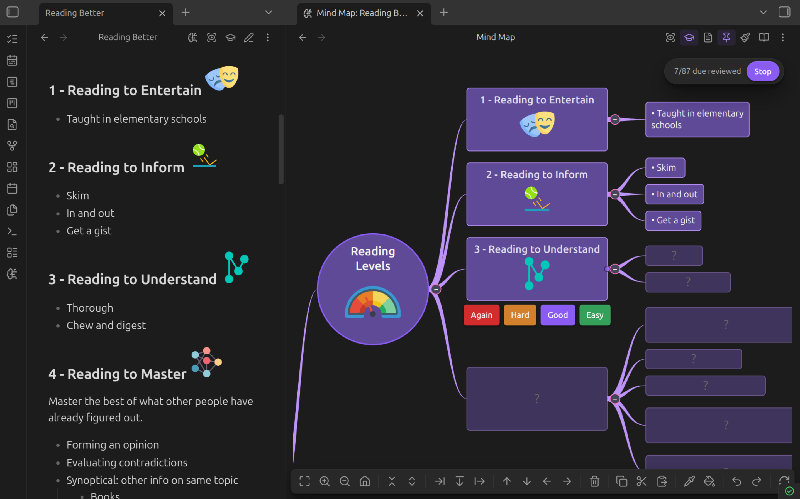
    </div>
  </div>
</section>

<!-- ===================== Pillars ===================== -->
<section class="osmosis-band osmosis-band--tight">
  <div class="osmosis-home__inner">
    <ul class="osmosis-pillars">
      <li>
        <svg xmlns="http://www.w3.org/2000/svg" width="24" height="24" viewBox="0 0 24 24" fill="none" stroke="currentColor" stroke-width="2" stroke-linecap="round" stroke-linejoin="round" class="lucide lucide-palette-icon lucide-palette"><path d="M12 22a1 1 0 0 1 0-20 10 9 0 0 1 10 9 5 5 0 0 1-5 5h-2.25a1.75 1.75 0 0 0-1.4 2.8l.3.4a1.75 1.75 0 0 1-1.4 2.8z"/><circle cx="13.5" cy="6.5" r=".5" fill="currentColor"/><circle cx="17.5" cy="10.5" r=".5" fill="currentColor"/><circle cx="6.5" cy="12.5" r=".5" fill="currentColor"/><circle cx="8.5" cy="7.5" r=".5" fill="currentColor"/></svg>
        <h3>Your learning has flow.</h3>
        <p>Write notes and study cards together in one app. Organize your thoughts with style.</p>
      </li>
      <li>
        <svg xmlns="http://www.w3.org/2000/svg" width="24" height="24" viewBox="0 0 24 24" fill="none" stroke="currentColor" stroke-width="2" stroke-linecap="round" stroke-linejoin="round" class="lucide lucide-waypoints-icon lucide-waypoints"><path d="m10.586 5.414-5.172 5.172"/><path d="m18.586 13.414-5.172 5.172"/><path d="M6 12h12"/><circle cx="12" cy="20" r="2"/><circle cx="12" cy="4" r="2"/><circle cx="20" cy="12" r="2"/><circle cx="4" cy="12" r="2"/></svg>
        <h3>Your memory is connected.</h3>
        <p>Answer flashcards on a visual map. Learn facts while seeing the big picture.</p>
      </li>
      <li>
        <svg xmlns="http://www.w3.org/2000/svg" width="24" height="24" viewBox="0 0 24 24" fill="none" stroke="currentColor" stroke-width="2" stroke-linecap="round" stroke-linejoin="round" class="lucide lucide-infinity-icon lucide-infinity"><path d="M6 16c5 0 7-8 12-8a4 4 0 0 1 0 8c-5 0-7-8-12-8a4 4 0 1 0 0 8"/></svg>
        <h3>Your notes should last.</h3>
        <p>Osmosis authors your content in plain text — readable in any editor and yours to keep forever.</p>
      </li>
    </ul>
  </div>
</section>

<!-- ===================== Mind maps ===================== -->
<section class="osmosis-band">
  <div class="osmosis-home__inner osmosis-band__head">
    <p class="osmosis-home__eyebrow">Mind maps</p>
    <h2>Visualize your thoughts.</h2>
    <p class="osmosis-band__lead">
      Headings become branches. Lists become nodes. Every edit on the map is an
      edit to the file.
    </p>
  </div>

  <div class="osmosis-home__inner">
    <ul class="osmosis-mediacards">
      <li>
        <h3>Interactive mind mapping</h3>
        <p>
          Add a node, drag a branch under a new parent, fold a subtree. Osmosis syncs your notes as you edit the map.
          <a class="osmosis-story__link" href="mind-mapping/editing/">Editing and shortcuts &rarr;</a>
        </p>
        <div class="osmosis-mediacards__shot">
          <!-- MEDIA SWAP: video V2 (add node, drag branch, fold subtree) -->
          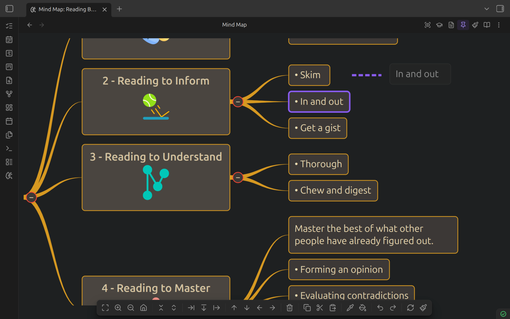
        </div>
      </li>
      <li>
        <h3>Colorful theming</h3>
        <p>
          Layout, spacing, branch lines, and per-node shape and colour — all
          saved in the note's frontmatter, so a map travels with its file.
          <a class="osmosis-story__link" href="mind-mapping/styling/">Styling &rarr;</a>
        </p>
        <div class="osmosis-mediacards__shot">
          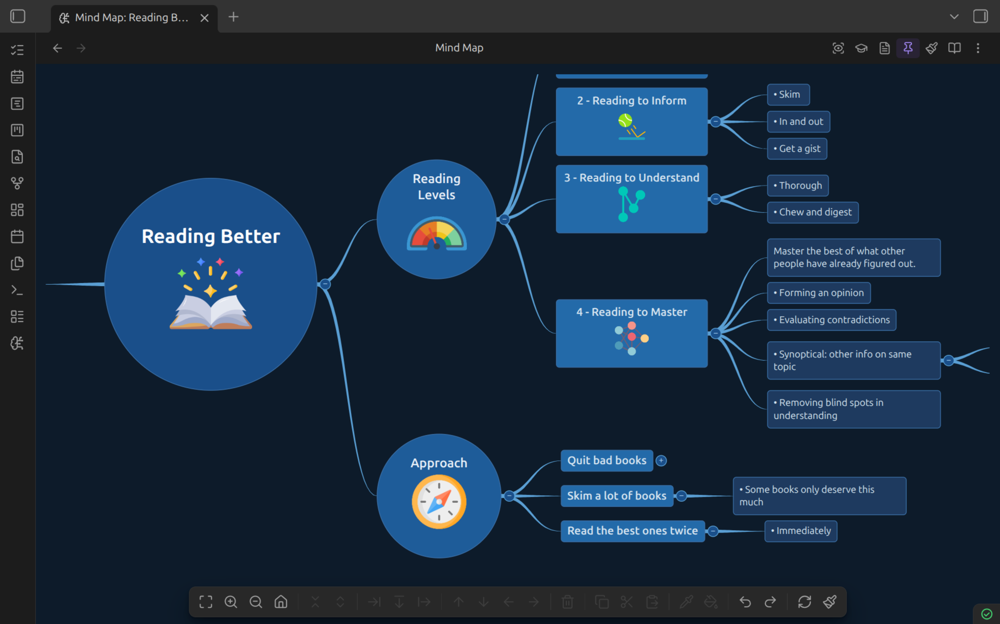
        </div>
      </li>
      <li>
        <h3>Maps inside maps</h3>
        <p>
          Embed a note with <code>![[note]]</code> and its structure becomes a
          sub-branch you can edit in place.
          <a class="osmosis-story__link" href="mind-mapping/#transclusion">Transclusion &rarr;</a>
        </p>
        <div class="osmosis-mediacards__shot">
          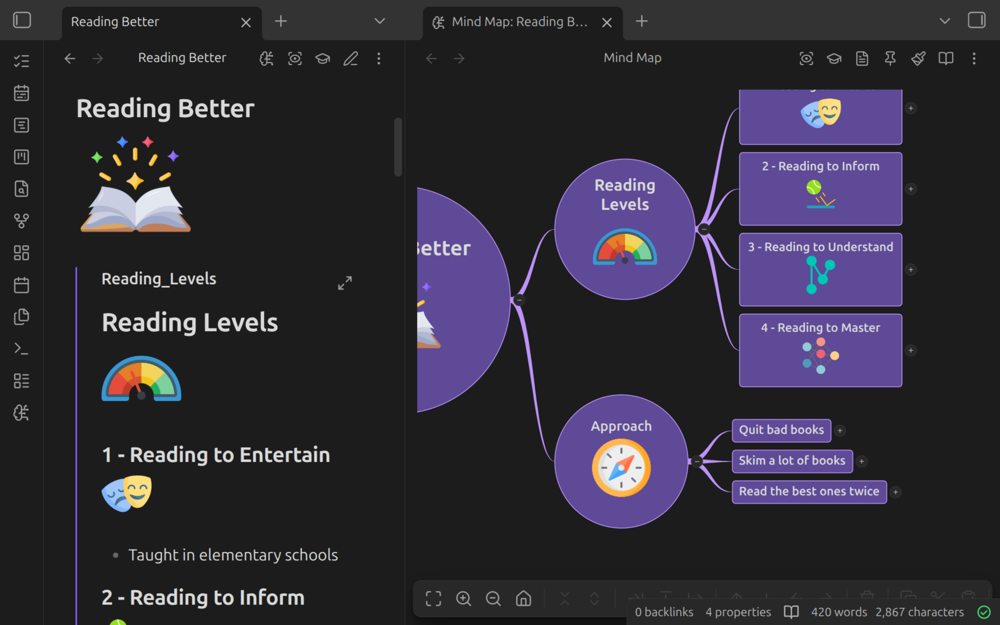
        </div>
      </li>
      <li>
        <h3>Enhanced Markdown support</h3>
        <p>
          Tables, code blocks, images, callouts, and LaTeX render inside the
          node — just like they do in your notes.
          <a class="osmosis-story__link" href="mind-mapping/#how-markdown-maps-to-nodes">What becomes a node &rarr;</a>
        </p>
        <div class="osmosis-mediacards__shot">
          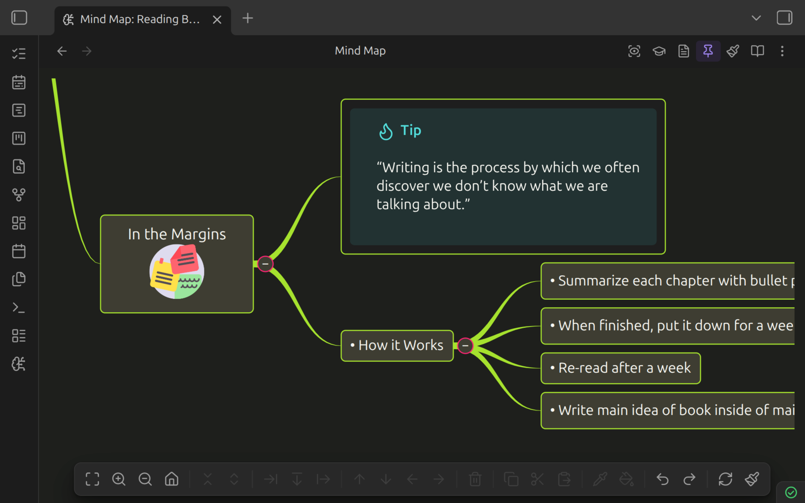
        </div>
      </li>
    </ul>
  </div>
</section>

<!-- ===================== Flashcards ===================== -->
<section class="osmosis-band">
  <section class="osmosis-story">
    <div class="osmosis-story__copy">
      <p class="osmosis-home__eyebrow">Flashcards</p>
      <h2>Cards that live in your notes.</h2>
      <p class="osmosis-story__body">
        Write a card where the idea comes up. Seven card types, all landing in
        the Markdown file you were already writing — and
        <a href="flashcards/rapid-capture/">Rapid Capture</a> turns a run of
        typing into cards as you go.
      </p>
      <ul class="osmosis-story__list" data-osmosis-swap="cards">
        <li data-osmosis-swap-key="basic">
          <svg xmlns="http://www.w3.org/2000/svg" viewBox="0 0 24 24" fill="none" stroke="currentColor" stroke-width="2" stroke-linecap="round" stroke-linejoin="round" aria-hidden="true"><path d="M12.83 2.18a2 2 0 0 0-1.66 0L2.6 6.08a1 1 0 0 0 0 1.83l8.58 3.91a2 2 0 0 0 1.66 0l8.58-3.9a1 1 0 0 0 0-1.83z"/><path d="m6.08 10.37-3.48 1.58a1 1 0 0 0 0 1.83l8.58 3.91a2 2 0 0 0 1.66 0l8.58-3.9a1 1 0 0 0 0-1.83l-3.5-1.59"/></svg>
          <p><strong>Basic.</strong> A classic front and a back experience.</p>
        </li>
        <li data-osmosis-swap-key="bidi">
          <svg xmlns="http://www.w3.org/2000/svg" viewBox="0 0 24 24" fill="none" stroke="currentColor" stroke-width="2" stroke-linecap="round" stroke-linejoin="round" aria-hidden="true"><path d="M8 3 4 7l4 4"/><path d="M4 7h16"/><path d="m16 21 4-4-4-4"/><path d="M20 17H4"/></svg>
          <p><strong>Bidirectional.</strong> One fence, two cards, scheduled apart.</p>
        </li>
        <li data-osmosis-swap-key="typein">
          <svg xmlns="http://www.w3.org/2000/svg" viewBox="0 0 24 24" fill="none" stroke="currentColor" stroke-width="2" stroke-linecap="round" stroke-linejoin="round" aria-hidden="true"><rect width="20" height="16" x="2" y="4" rx="2"/><path d="M6 8h.01"/><path d="M10 8h.01"/><path d="M14 8h.01"/><path d="M18 8h.01"/><path d="M8 12h.01"/><path d="M12 12h.01"/><path d="M16 12h.01"/><path d="M7 16h10"/></svg>
          <p><strong>Type-in.</strong> Type the answer instead of flipping the card.</p>
        </li>
        <li data-osmosis-swap-key="cloze">
          <svg xmlns="http://www.w3.org/2000/svg" viewBox="0 0 24 24" fill="none" stroke="currentColor" stroke-width="2" stroke-linecap="round" stroke-linejoin="round" aria-hidden="true"><path d="M5 3a2 2 0 0 0-2 2"/><path d="M19 3a2 2 0 0 1 2 2"/><path d="M21 19a2 2 0 0 1-2 2"/><path d="M5 21a2 2 0 0 1-2-2"/><path d="M9 3h1"/><path d="M9 21h1"/><path d="M14 3h1"/><path d="M14 21h1"/><path d="M3 9v1"/><path d="M21 9v1"/><path d="M3 14v1"/><path d="M21 14v1"/></svg>
          <p><strong>Cloze deletion.</strong> Blank out a span; each blank is a card.</p>
        </li>
        <li data-osmosis-swap-key="codecloze">
          <svg xmlns="http://www.w3.org/2000/svg" viewBox="0 0 24 24" fill="none" stroke="currentColor" stroke-width="2" stroke-linecap="round" stroke-linejoin="round" aria-hidden="true"><path d="m16 18 6-6-6-6"/><path d="m8 6-6 6 6 6"/></svg>
          <p><strong>Code cloze.</strong> Hide code, highlighting left intact.</p>
        </li>
        <li data-osmosis-swap-key="occlusion">
          <svg xmlns="http://www.w3.org/2000/svg" viewBox="0 0 24 24" fill="none" stroke="currentColor" stroke-width="2" stroke-linecap="round" stroke-linejoin="round" aria-hidden="true"><rect width="18" height="18" x="3" y="3" rx="2"/><circle cx="9" cy="9" r="2"/><path d="m21 15-3.09-3.09a2 2 0 0 0-2.82 0L6 21"/></svg>
          <p><strong>Image occlusion.</strong> Mask a diagram; each group is a card.</p>
        </li>
        <li data-osmosis-swap-key="lines">
          <svg xmlns="http://www.w3.org/2000/svg" viewBox="0 0 24 24" fill="none" stroke="currentColor" stroke-width="2" stroke-linecap="round" stroke-linejoin="round" aria-hidden="true"><path d="M12 3v18"/><path d="M3 7.5h4"/><path d="M3 12h4"/><path d="M3 16.5h4"/><path d="M17 7.5h4"/><path d="M17 12h4"/><path d="M17 16.5h4"/></svg>
          <p><strong>Line cards.</strong> One command cards a whole note, line by line.</p>
        </li>
      </ul>
      <a class="osmosis-story__link" href="flashcards/card-types/">See the card types &rarr;</a>
    </div>
    <!-- Pointing at a row above brings its frame forward — see
         assets/javascripts/home-media.js. Only Basic and Code cloze have their
         own capture; the rest are stand-ins drawn from the closest still we
         have, each marked below with the shot it is waiting for. -->
    <div class="osmosis-story__media osmosis-swap" data-osmosis-swap-target="cards">
      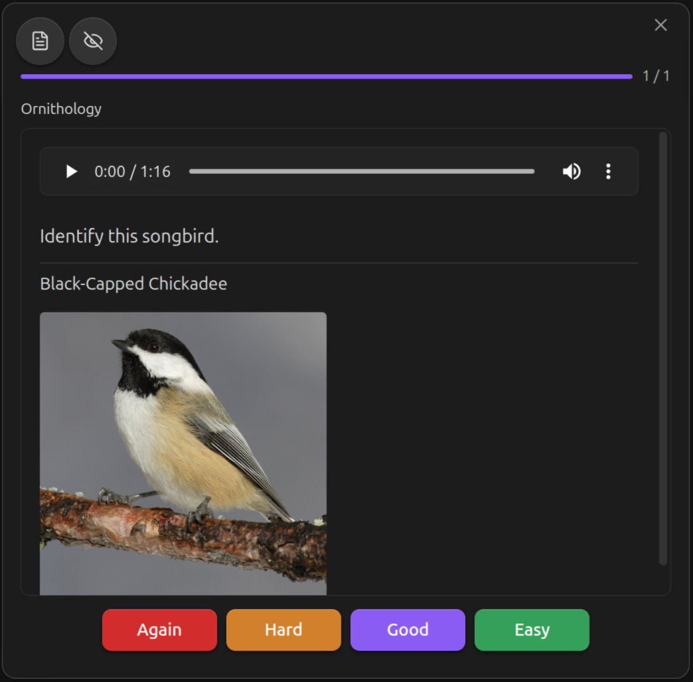
      <!-- MEDIA SWAP: still of a bidirectional card studied in its reverse direction -->
      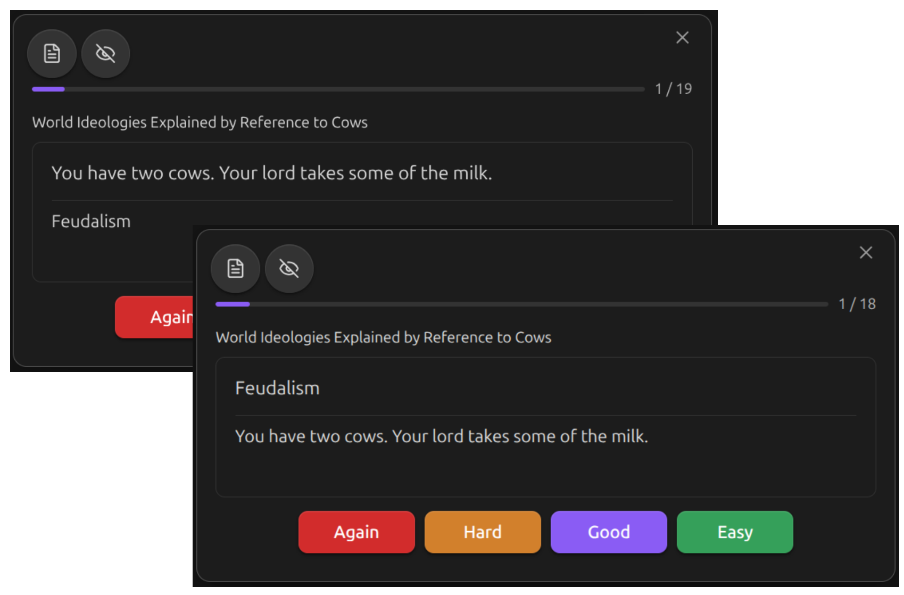
      <!-- MEDIA SWAP: still of a type-in card with a graded answer in the input -->
      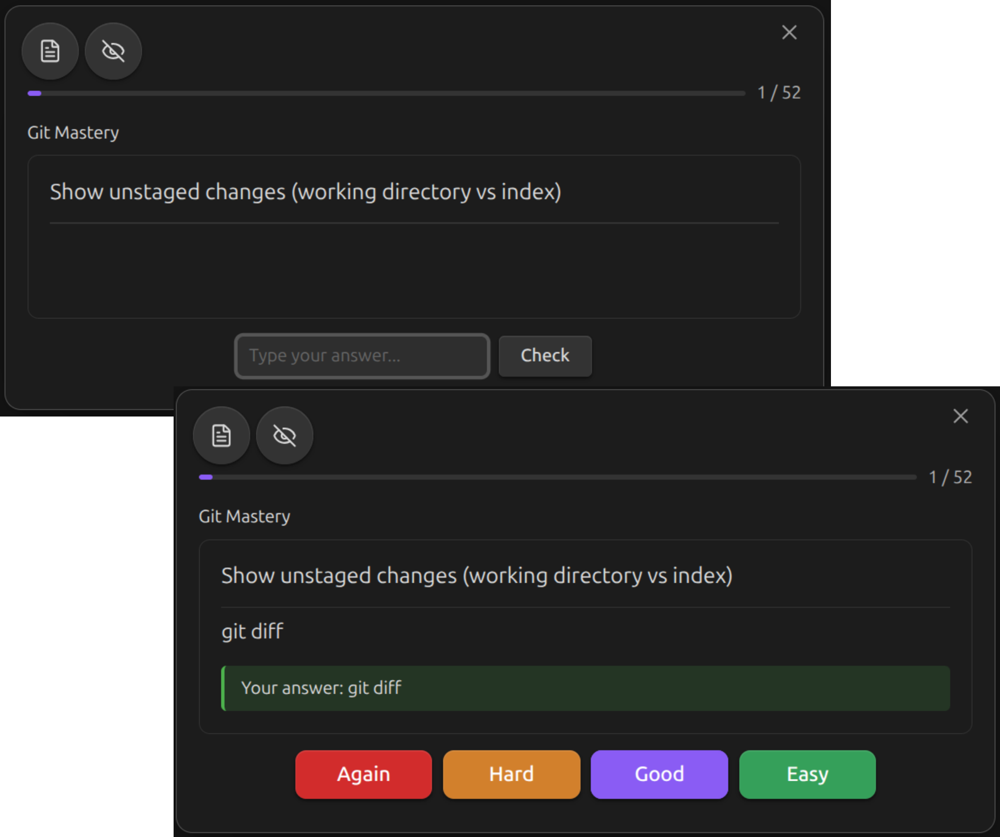
      <!-- MEDIA SWAP: still of a cloze card with one blank hidden -->
      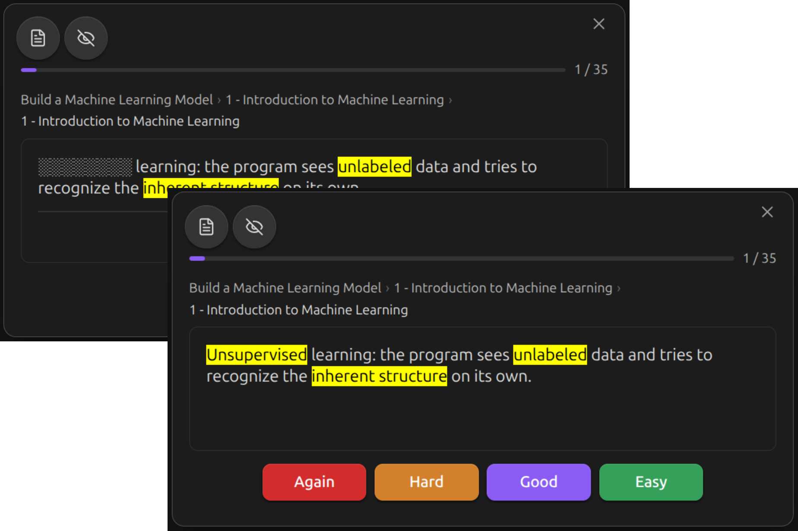
      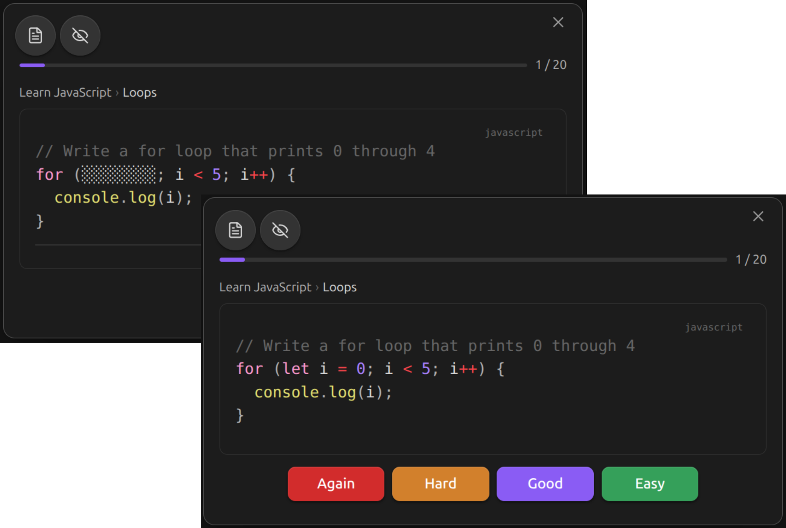
      <!-- MEDIA SWAP: still of the occlusion editor, masks drawn over a diagram -->
      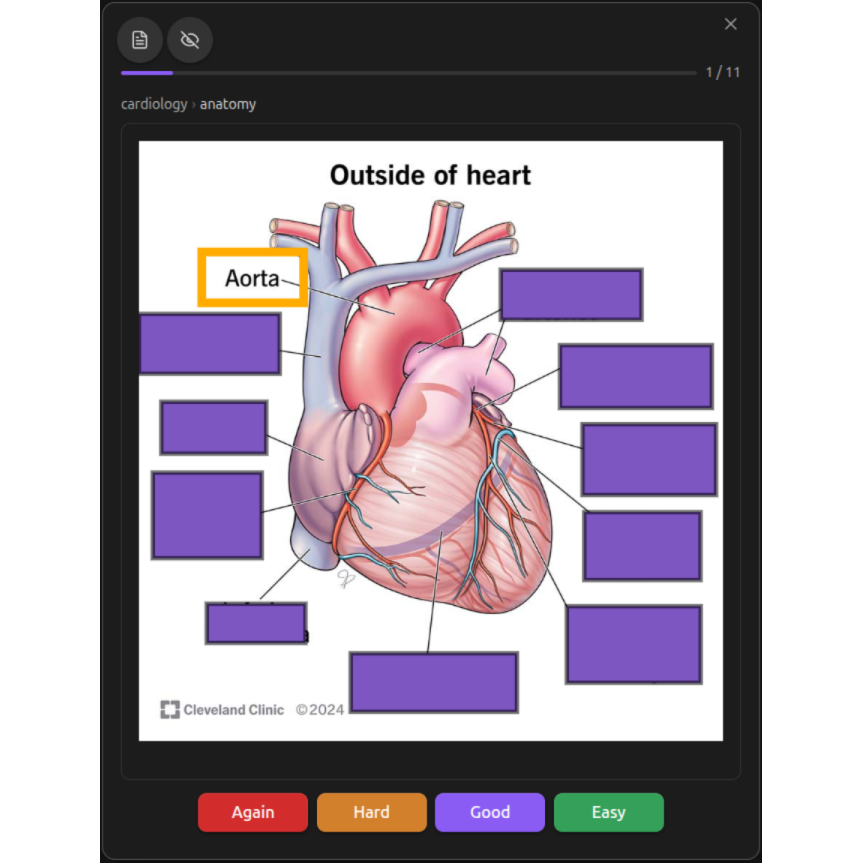
      <!-- MEDIA SWAP: still of a note whose lines have become cards -->
      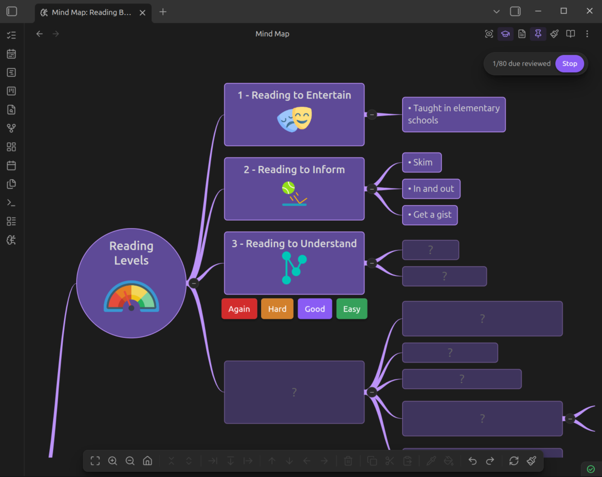
    </div>
  </section>
</section>

<!-- ===================== Studying ===================== -->
<section class="osmosis-band">
  <div class="osmosis-home__inner osmosis-band__head osmosis-band__head--start">
    <p class="osmosis-home__eyebrow">Studying</p>
    <h2>Three ways to study the same card.</h2>
    <p class="osmosis-band__lead">
      Study any card in any mode, scheduled by FSRS — a system
      built on memory research. Rate a card anywhere and its schedule updates consistently.
    </p>
    <a class="osmosis-story__link" href="studying/study-modes/">Compare study modes &rarr;</a>
  </div>

  <div class="osmosis-home__inner">
    <ul class="osmosis-pillars osmosis-pillars--swap" data-osmosis-swap="study">
      <li data-osmosis-swap-key="spatial">
        <svg xmlns="http://www.w3.org/2000/svg" viewBox="0 0 24 24" fill="none" stroke="currentColor" stroke-width="2" stroke-linecap="round" stroke-linejoin="round" aria-hidden="true"><rect width="6" height="6" x="16" y="16" rx="1"/><rect width="6" height="6" x="2" y="16" rx="1"/><rect width="6" height="6" x="9" y="2" rx="1"/><path d="M5 16v-3a1 1 0 0 1 1-1h12a1 1 0 0 1 1 1v3"/><path d="M12 12V8"/></svg>
        <h3>On the map</h3>
        <p>Spatial study hides due cards behind placeholders while the rest of the map stays visible — you recall a fact with everything it connects to still on screen.</p>
      </li>
      <li data-osmosis-swap-key="contextual">
        <svg xmlns="http://www.w3.org/2000/svg" viewBox="0 0 24 24" fill="none" stroke="currentColor" stroke-width="2" stroke-linecap="round" stroke-linejoin="round" aria-hidden="true"><path d="M14 2v4a2 2 0 0 0 2 2h4"/><path d="M15 2H6a2 2 0 0 0-2 2v16a2 2 0 0 0 2 2h12a2 2 0 0 0 2-2V7z"/><path d="M8 13h4"/><path d="M8 17h6"/></svg>
        <h3>In the note</h3>
        <p>Contextual study hides what's due, reveals it in place, and lets you rate it and read on. Peek mode reveals a card and leaves its schedule untouched.</p>
      </li>
      <li data-osmosis-swap-key="sequential">
        <svg xmlns="http://www.w3.org/2000/svg" viewBox="0 0 24 24" fill="none" stroke="currentColor" stroke-width="2" stroke-linecap="round" stroke-linejoin="round" aria-hidden="true"><rect width="16" height="20" x="4" y="2" rx="2"/><path d="M8 8h8"/><path d="M8 13h5"/><path d="M8 18h3"/></svg>
        <h3>From a window</h3>
        <p>Sequential study is the classic deck run: one card at a time, with multi-level undo that restores each card's previous schedule as it steps back.</p>
      </li>
    </ul>

    <!-- Pointing at a mode above brings its frame forward — see
         assets/javascripts/home-media.js. -->
    <div class="osmosis-band__media osmosis-swap" data-osmosis-swap-target="study">
      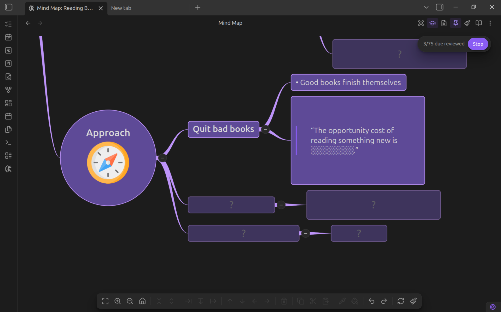
      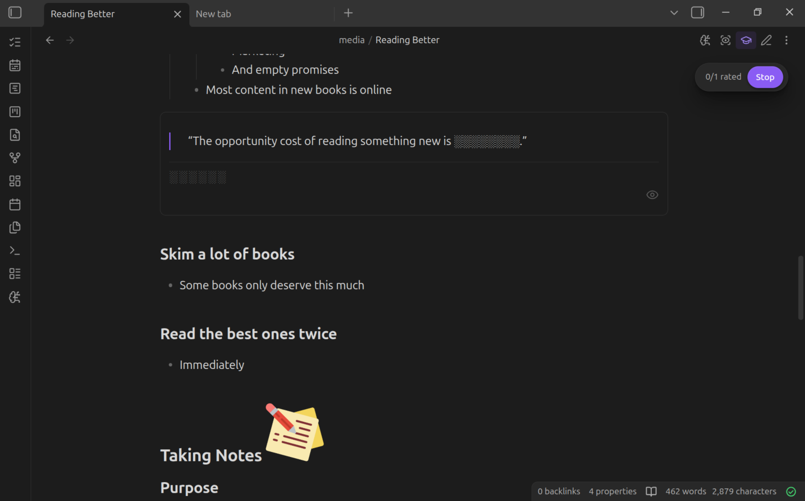
      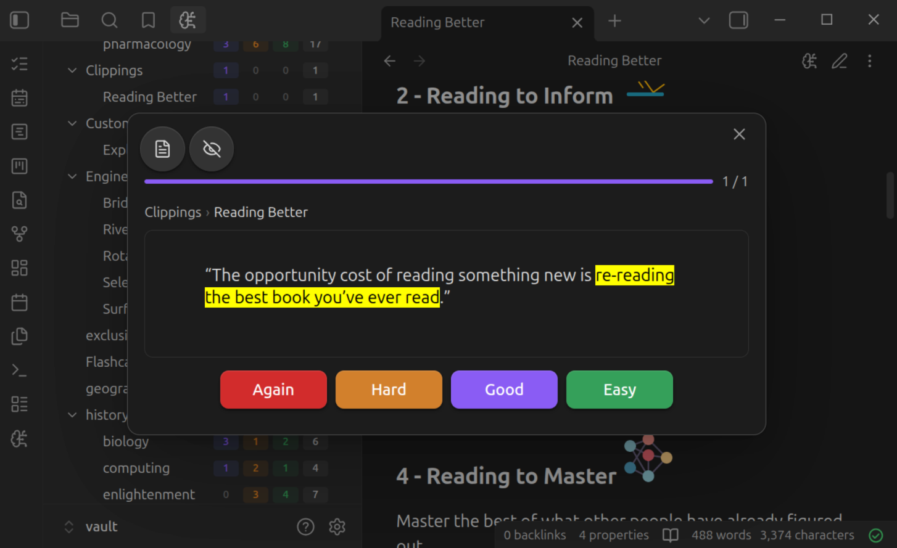
    </div>
  </div>
</section>

<!-- ===================== Dashboard ===================== -->
<section class="osmosis-band">
  <div class="osmosis-home__inner osmosis-band__head">
    <p class="osmosis-home__eyebrow">Dashboard</p>
    <h2>A clear view of your learning.</h2>
    <p class="osmosis-band__lead">
      Navigate your decks, get a birds-eye view of your learning patterns, and find every flashcard in your vault with ease.
    </p>
  </div>

  <div class="osmosis-home__inner">
    <ul class="osmosis-mediacards">
      <li>
        <h3>Analyze your growth</h3>
        <p>
          A year-long heatmap, true retention, interval and stability, answer
          buttons, and your load for the weeks ahead — plus recall by study mode,
          which shows how well the facts you studied in context are holding.
          <a class="osmosis-story__link" href="studying/statistics/">Statistics &rarr;</a>
        </p>
        <div class="osmosis-mediacards__shot">
          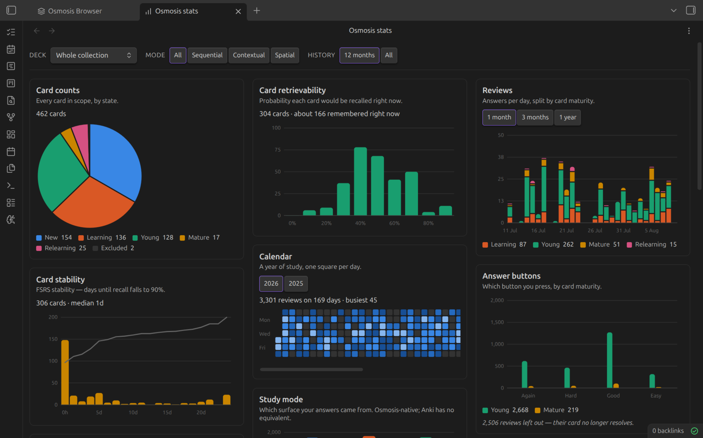
        </div>
      </li>
      <li>
        <h3>Find any card</h3>
        <p>
          The browser is a Bases view, so Obsidian's own filtering narrows it to
          the notes you care about. Then suspend, reset, change deck, or delete flashcards —
          with undo if you change your mind.
          <a class="osmosis-story__link" href="studying/card-browser/">Card browser &rarr;</a>
        </p>
        <div class="osmosis-mediacards__shot">
          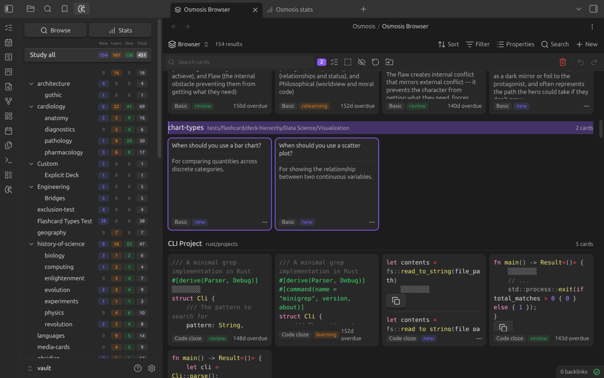
        </div>
      </li>
    </ul>
  </div>
</section>

<!-- ===================== Your data ===================== -->
<section class="osmosis-band">
  <section class="osmosis-story osmosis-story--reverse">
    <div class="osmosis-story__copy">
      <p class="osmosis-home__eyebrow">Your data</p>
      <h2>Plain Markdown. Forever.</h2>
      <p class="osmosis-story__body">
        A card's schedule lives in the fence that holds it, or in the note's
        frontmatter beside the line it belongs to. Your vault syncs the way it
        always has — Obsidian Sync, iCloud, Dropbox, Git — and your review
        history goes with it.
      </p>
      <p class="osmosis-story__body">
        Because it is only ever text, an AI assistant can read and write your
        study material natively — and so can every other tool that has ever
        opened a Markdown file.
      </p>
      <a class="osmosis-story__link" href="reference/data-storage/">How it's stored &rarr;</a>
    </div>
    <div class="osmosis-story__media">

````markdown
## Ownership and borrowing

- Each value has exactly one owner ^b3f1a2

```osmosis
id: os-3jds9x
due: 2026-05-02T19:52:12.592Z
stability: 2.0215
difficulty: 6.3909
reps: 3
lapses: 0
state: review
last-review: 2026-04-30T19:52:12.592Z
learning-steps: 0

What happens when an owner goes out of scope?
***
The value is dropped and its memory freed.
```
````

  </div>
  </section>
</section>

<!-- ===================== Feature grid ===================== -->
<section class="osmosis-features">
  <div class="osmosis-home__inner">
    <h2>Fully featured.</h2>
    <ul class="osmosis-features__grid">
      <li>
        <svg xmlns="http://www.w3.org/2000/svg" viewBox="0 0 24 24" fill="none" stroke="currentColor" stroke-width="2" stroke-linecap="round" stroke-linejoin="round" aria-hidden="true"><path d="m17 2 4 4-4 4"/><path d="M3 11v-1a4 4 0 0 1 4-4h14"/><path d="m7 22-4-4 4-4"/><path d="M21 13v1a4 4 0 0 1-4 4H3"/></svg>
        <h3>Two-way everything</h3>
        <p>Edit the note, the map, or the card — the other two follow, immediately.</p>
      </li>
      <li>
        <svg xmlns="http://www.w3.org/2000/svg" viewBox="0 0 24 24" fill="none" stroke="currentColor" stroke-width="2" stroke-linecap="round" stroke-linejoin="round" aria-hidden="true"><rect width="20" height="16" x="2" y="4" rx="2"/><path d="M6 8h.001"/><path d="M10 8h.001"/><path d="M14 8h.001"/><path d="M18 8h.001"/><path d="M6 12h.001"/><path d="M18 12h.001"/><path d="M10 12h4"/><path d="M7 16h10"/></svg>
        <h3>Keyboard first</h3>
        <p>Full keyboard control of map editing, navigation, and a review session.</p>
      </li>
      <li>
        <svg xmlns="http://www.w3.org/2000/svg" viewBox="0 0 24 24" fill="none" stroke="currentColor" stroke-width="2" stroke-linecap="round" stroke-linejoin="round" aria-hidden="true"><rect width="14" height="20" x="5" y="2" rx="2"/><path d="M12 18h.01"/></svg>
        <h3>Built for mobile</h3>
        <p>Touch gestures throughout, a reading-mode default for phones, and capture designed for thumbs.</p>
      </li>
      <li>
        <svg xmlns="http://www.w3.org/2000/svg" viewBox="0 0 24 24" fill="none" stroke="currentColor" stroke-width="2" stroke-linecap="round" stroke-linejoin="round" aria-hidden="true"><path d="M3 3v16a2 2 0 0 0 2 2h16"/><path d="M7 16h8"/><path d="M7 11h12"/><path d="M7 6h3"/></svg>
        <h3>Rich nodes</h3>
        <p>Images, LaTeX, code blocks, tables, callouts, checkboxes, and embeds render inside the map.</p>
      </li>
      <li>
        <svg xmlns="http://www.w3.org/2000/svg" viewBox="0 0 24 24" fill="none" stroke="currentColor" stroke-width="2" stroke-linecap="round" stroke-linejoin="round" aria-hidden="true"><path d="M9 14 4 9l5-5"/><path d="M4 9h10.5a5.5 5.5 0 0 1 5.5 5.5 5.5 5.5 0 0 1-5.5 5.5H11"/></svg>
        <h3>Undo that fits the map</h3>
        <p>Map edits have their own history — one step per operation, with configurable depth and memory.</p>
      </li>
      <li>
        <svg xmlns="http://www.w3.org/2000/svg" viewBox="0 0 24 24" fill="none" stroke="currentColor" stroke-width="2" stroke-linecap="round" stroke-linejoin="round" aria-hidden="true"><path d="M20 6 9 17l-5-5"/></svg>
        <h3>Opt in, or opt out</h3>
        <p>Per note, per folder, per tag — and exclusion always wins, so a vault-in-a-vault stays out.</p>
      </li>
      <li>
        <svg xmlns="http://www.w3.org/2000/svg" viewBox="0 0 24 24" fill="none" stroke="currentColor" stroke-width="2" stroke-linecap="round" stroke-linejoin="round" aria-hidden="true"><path d="M12 3v18"/><path d="M3 7.5h4"/><path d="M3 12h4"/><path d="M3 16.5h4"/><path d="M17 7.5h4"/><path d="M17 12h4"/><path d="M17 16.5h4"/></svg>
        <h3>Native block IDs</h3>
        <p>Cards anchor to Obsidian's own <code>^block-ids</code>, so <code>[[note#^id]]</code> links work and history survives edits.</p>
      </li>
      <li>
        <svg xmlns="http://www.w3.org/2000/svg" viewBox="0 0 24 24" fill="none" stroke="currentColor" stroke-width="2" stroke-linecap="round" stroke-linejoin="round" aria-hidden="true"><path d="M21 12a9 9 0 1 1-6.219-8.56"/><path d="M12 7v5l3 3"/></svg>
        <h3>Every review, logged</h3>
        <p>An append-only history in your vault, per month and per device, that syncs with your notes.</p>
      </li>
      <li>
        <svg xmlns="http://www.w3.org/2000/svg" viewBox="0 0 24 24" fill="none" stroke="currentColor" stroke-width="2" stroke-linecap="round" stroke-linejoin="round" aria-hidden="true"><circle cx="12" cy="12" r="10"/><path d="M12 2a14.5 14.5 0 0 0 0 20 14.5 14.5 0 0 0 0-20"/><path d="M2 12h20"/></svg>
        <h3>Free and open source</h3>
        <p>GPL-3.0, developed in the open, with every feature available to everyone.</p>
      </li>
    </ul>
  </div>
</section>

<!-- ===================== Closing CTA ===================== -->
<section class="osmosis-cta">
  <div class="osmosis-home__inner">
    <h2>Start with one note.</h2>
    <p>
      Open any Markdown file you already have, press the mind map button, and
      see the structure you have been writing all along.
    </p>
    <div class="osmosis-cta__actions">
      <a class="osmosis-btn osmosis-btn--primary" href="obsidian://show-plugin?id=osmosis">Install Osmosis</a>
      <a class="osmosis-btn osmosis-btn--ghost" href="getting-started/">Read the docs &rarr;</a>
    </div>
  </div>
</section>

</div>
