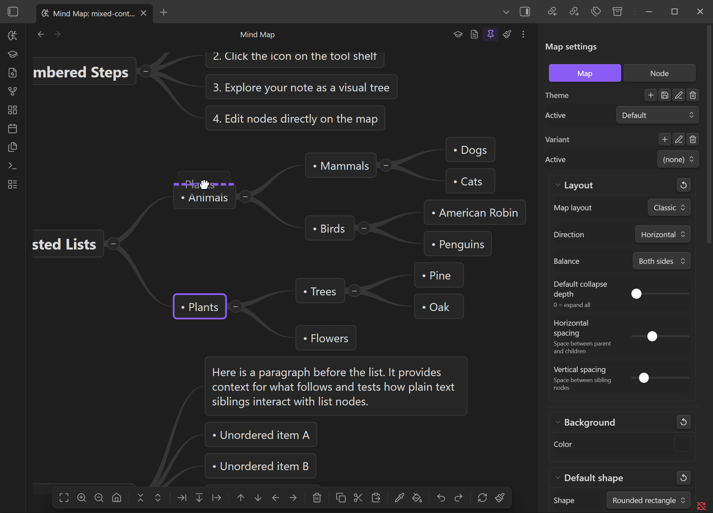

# Editing

Double-click a node (or press ++f2++) to enter edit mode. Press ++escape++ to cancel.

## Toolbar

The toolbar is a sticky action bar at the bottom of the mind map view. It provides quick access to all major actions — hover over any button for a tooltip.

| Icon | Action | Requires Selection |
|------|--------|--------------------|
| :lucide-maximize: | Fit to view | No |
| :lucide-zoom-in: | Zoom in | No |
| :lucide-zoom-out: | Zoom out | No |
| :lucide-home: | Center on root | No |
| :lucide-chevrons-down-up: | Collapse all | Yes |
| :lucide-chevrons-up-down: | Expand all | Yes |
| :lucide-arrow-right-to-line: | Insert parent | Yes |
| :lucide-arrow-down-from-line: | Add sibling | Yes |
| :lucide-arrow-right-from-line: | Add child | Yes |
| :lucide-arrow-up: | Move up | Yes |
| :lucide-arrow-down: | Move down | Yes |
| :lucide-arrow-left: | Move left (outdent) | Yes |
| :lucide-arrow-right: | Move right (indent) | Yes |
| :lucide-trash-2: | Delete | Yes |
| :lucide-copy: | Copy | Yes |
| :lucide-scissors: | Cut | Yes |
| :lucide-clipboard-paste: | Paste | Yes |
| :lucide-pipette: | Copy style | Yes |
| :lucide-paint-bucket: | Paste style | Yes |
| :lucide-undo-2: | Undo | No |
| :lucide-redo-2: | Redo | No |
| :lucide-refresh-cw: | Refresh mind map | No |
| :lucide-paintbrush: | Map properties | No |

Buttons that require a selection are dimmed when no node is selected. The toolbar hides automatically when you're editing a node's text.

## Structure Operations

| Action | Keyboard | Context Menu |
|--------|----------|--------------|
| Add child | ++tab++ | Add child |
| Add sibling | ++enter++ | Add sibling |
| Insert parent | ++ctrl+enter++ | Insert parent |
| Delete | ++delete++ or ++backspace++ | Delete |
| Duplicate | ++ctrl+d++ | — |
| Indent | ++alt+right++ | — |
| Outdent | ++alt+left++ | — |
| Move up | ++alt+up++ | — |
| Move down | ++alt+down++ | — |

!!! tip
    **Indent** makes the node a child of its previous sibling. **Outdent** moves it up to its parent's level. These mirror the standard outliner operations.

## Clipboard

| Action | Keyboard |
|--------|----------|
| Copy | ++ctrl+c++ |
| Cut | ++ctrl+x++ |
| Paste as child | ++ctrl+v++ |

Copy and paste preserve the full subtree structure. You can also copy and paste node styles separately via the context menu.

## Undo / Redo

| Action | Keyboard |
|--------|----------|
| Undo | ++ctrl+z++ |
| Redo | ++ctrl+shift+z++ or ++ctrl+y++ |

## Context Menus

**Right-click a node** for:

- Add child, Add sibling, Insert parent
- Cut, Copy, Paste
- Copy style, Paste style
- Collapse all, Expand all
- Delete

**Right-click empty canvas** for:

- Fit to view
- Center on root
- Paste
- Collapse all, Expand all
- Refresh mind map
- Map properties
