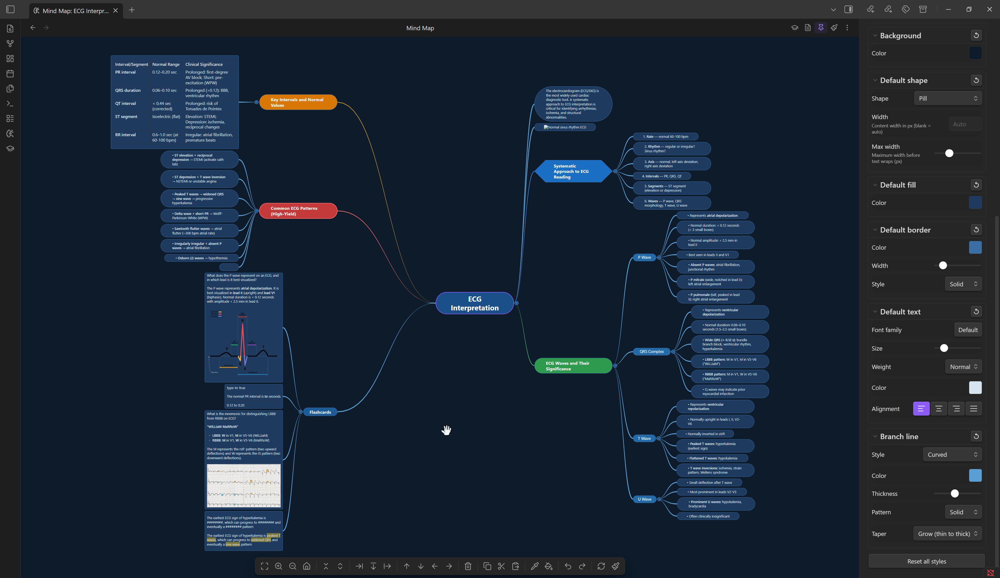
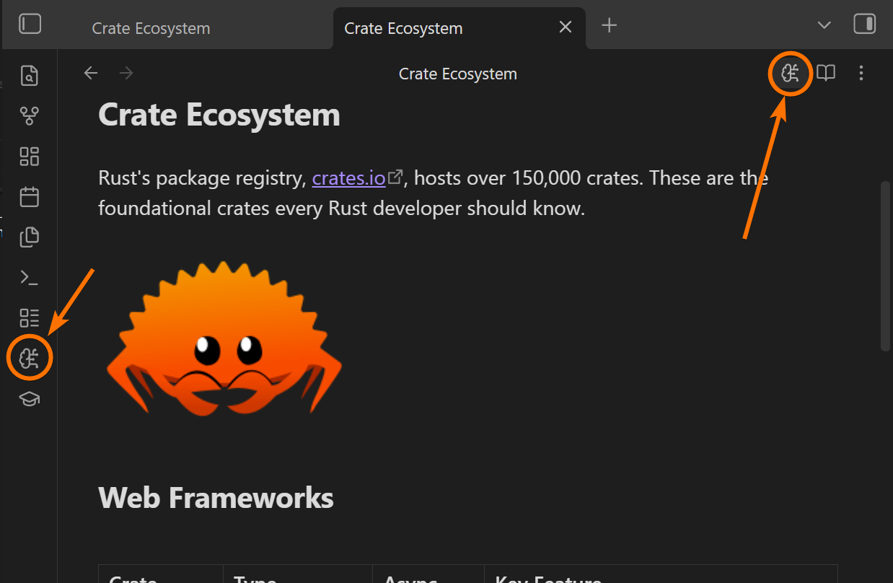
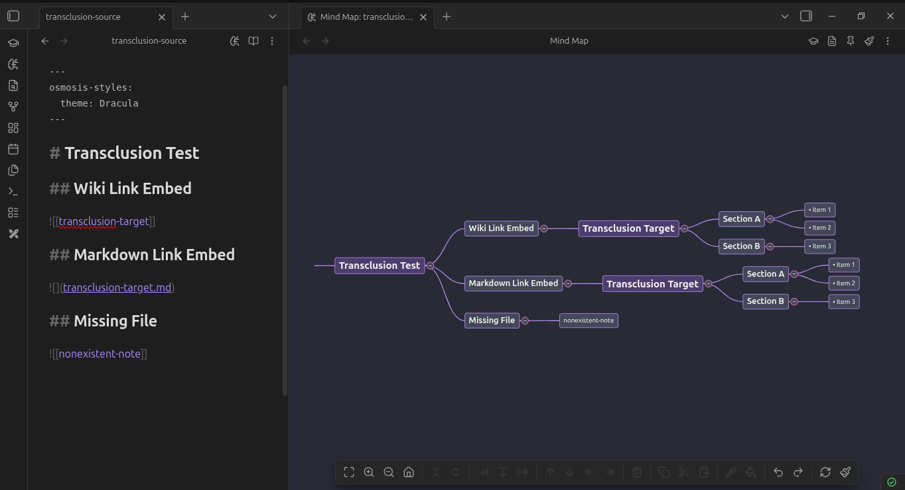

# Mind Mapping

Osmosis renders your markdown structure as a fully interactive mind map. Headings, bullet lists, and numbered lists become nodes. The map and your markdown stay in sync — edit one, and the other updates instantly.



## How Markdown Maps to Nodes

| Markdown | Node Type |
|----------|-----------|
| `# Heading` through `###### Heading` | Branch nodes (depth = heading level) |
| `- Item` or `* Item` | Bullet list nodes |
| `1. Item` | Numbered list nodes |
| Plain paragraphs | Paragraph nodes |
| `![[other-note]]` | Transcluded sub-branch |

Nodes render rich content — bold, italic, code, images, and LaTeX all display inside map nodes.

## Opening a Mind Map

| Method | How |
|--------|-----|
| Editor header | Click the :lucide-brain-circuit: icon next to the reading view toggle |
| Command palette | "Open mind map view" |
| File menu | Right-click a file > "Mind map view" |
| Ribbon | Click the :lucide-brain-circuit: icon in the left sidebar |



## Transclusion

Embed another note's content as a sub-branch using standard Obsidian syntax:

```markdown
## My Topic
- Key point
- ![[detailed-notes]]
```

The embedded note's heading and list structure appears as a collapsible sub-branch. Transcluded branches are lazy-loaded — they only parse when expanded. Editing a transcluded node writes changes to the source file.



## Cursor Sync

When enabled (on by default), clicking a node scrolls the markdown editor to that line, and placing your cursor in the editor highlights the corresponding node.

Toggle in **Settings > Osmosis > Cursor sync**.

## Touch Support

Osmosis works on Obsidian mobile:

| Action | Gesture |
|--------|---------|
| Pan | Single finger drag on canvas |
| Zoom | Pinch |
| Select | Tap a node |
| Edit | Double-tap a node |
| Context menu | Long-press a node or canvas |

## Guides

<div class="grid cards" markdown>

-   [:octicons-pencil-24: __Editing__](editing.md)

    Add, delete, move, and restructure nodes with keyboard shortcuts and context menus

-   [:octicons-arrow-switch-24: __Navigation__](navigation.md)

    Keyboard navigation, selection, viewport controls, and collapse/expand

-   [:octicons-paintbrush-24: __Styling__](styling.md)

    Themes, node shapes, branch lines, per-map settings, and the style cascade

</div>
