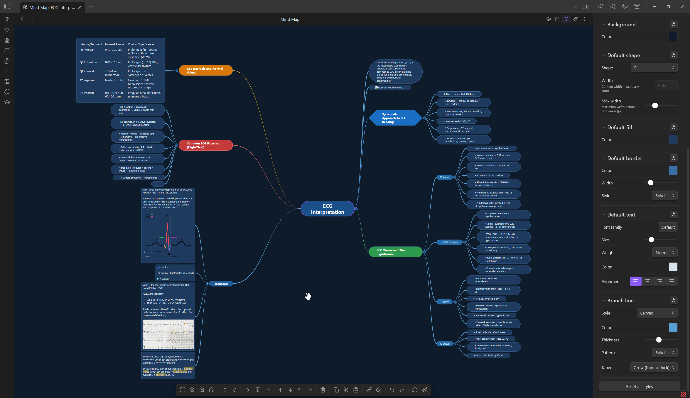
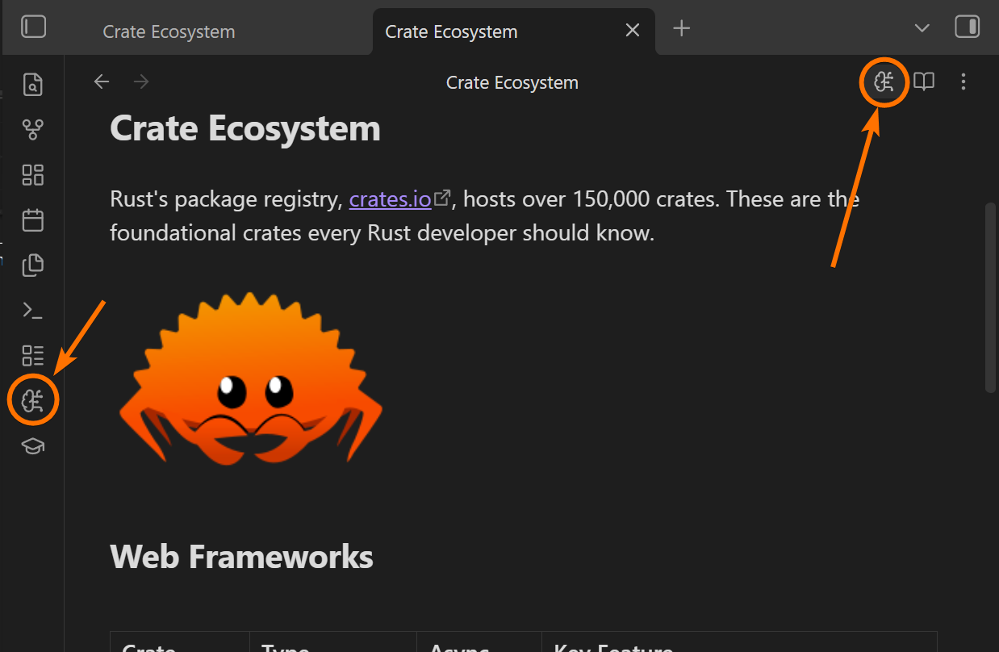
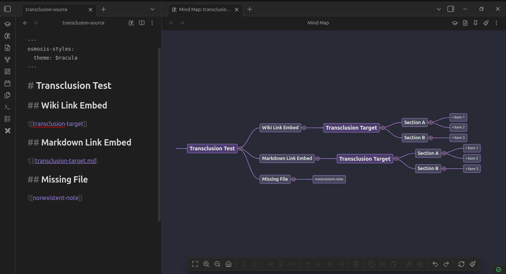

# Mind Mapping

Osmosis renders your markdown structure as a fully interactive mind map. Headings, bullet lists, and numbered lists become nodes. The map and your markdown stay in sync — edit one, and the other updates instantly.



## How Markdown Maps to Nodes

| Markdown | Node Type |
|----------|-----------|
| `# Heading` through `###### Heading` | Branch nodes (depth = heading level) |
| `- Item` or `* Item` | Bullet list nodes |
| `1. Item` | Numbered list nodes |
| Plain paragraphs | Paragraph nodes |
| `> Callout` or `> quote` | A single blockquote node |
| `![[other-note]]` | Transcluded sub-branch |

Nodes render rich content — bold, italic, code, images, and LaTeX all display inside map nodes.

!!! note "Multi-line blocks are one node"
    Code blocks, tables, and callouts/blockquotes each map to a **single** node rather than one node per line. For callouts, a run of consecutive `>`-prefixed lines — title, body, and any nested list — is one node; a blank or non-`>` line ends the run, so stacked callouts stay separate nodes.

## Opening a Mind Map

| Method | How |
|--------|-----|
| Editor header | Click the :lucide-brain-circuit: icon next to the reading view toggle |
| Command palette | "Open mind map view" |
| File menu | Right-click a file > "Mind map view" |
| Ribbon | Click the :lucide-brain-circuit: icon in the left sidebar |



## Reading Mode

Mind maps have a reading mode, mirroring the Markdown view's reading/editing toggle. In reading mode the map is safe to explore but **cannot be changed** — useful for reference maps, shared vaults, and phones, where a stray tap-drag used to rearrange your notes.

| Toggle | How |
|--------|-----|
| Header action | Click the :lucide-book-open: / :lucide-pencil: icon in the mind map header |
| Keyboard | ++ctrl+e++ (++cmd+e++ on macOS) |
| Command palette | "Toggle mind map reading mode" |

**What changes in reading mode:**

| Still works | Blocked |
|-------------|---------|
| Pan, zoom, fit to view | Adding, deleting, and moving nodes |
| Collapse / expand and keyboard navigation | In-place text editing (++f2++ / double-click) |
| Selection, copy, "Study this branch" | Drag-and-drop repositioning and node resizing |
| Spatial study and peek, including rating | Copy style / paste style from the map |
| Line card actions on the node menu | Cut, paste, and delete |

Dragging a node **pans the viewport** instead of moving the node, resize handles are hidden, and the toolbar collapses to navigation-only buttons. Node context menus keep just Copy, collapse/expand, Study this branch, and the [line card](../flashcards/line-cards.md#per-node-and-per-selection-control) actions.

!!! note "Study still counts"
    Spatial study and peek stay fully available in reading mode. Ratings are study metadata, not map edits — they never touch your note's structure.

The mode is remembered per pane, so one map can be open for reading while another is open for editing. To choose how maps open by default, set **Settings > Osmosis > Default mind map mode** to *Editing*, *Reading*, or *Reading on mobile only*.

!!! tip
    The properties sidebar stays live in reading mode by design — it's for styling the map, and styling isn't a structural edit to your note.

## Transclusion

Embed another note's content as a sub-branch using standard Obsidian syntax:

```markdown
## My Topic
- Key point
- ![[detailed-notes]]
```

The embedded note's heading and list structure appears as a collapsible sub-branch, loaded expanded by default. Turn off **Expand transclusions** in the plugin settings to lazy-load them instead — collapsed until first expanded. Editing a transcluded node writes changes to the source file.



## Cursor Sync

When enabled (on by default), clicking a node scrolls the markdown editor to that line, and placing your cursor in the editor highlights the corresponding node.

Toggle in **Settings > Osmosis > Cursor sync**.

## Touch Support

Osmosis works on Obsidian mobile:

| Action | Gesture |
|--------|---------|
| Pan | Single finger drag on canvas |
| Zoom | Pinch |
| Select | Tap a node |
| Edit | Double-tap a node |
| Context menu | Long-press a node or canvas |

## Guides

<div class="grid cards" markdown>

-   [:octicons-pencil-24: __Editing__](editing.md)

    Add, delete, move, and restructure nodes with keyboard shortcuts and context menus

-   [:octicons-arrow-switch-24: __Navigation__](navigation.md)

    Keyboard navigation, selection, viewport controls, and collapse/expand

-   [:octicons-paintbrush-24: __Styling__](styling.md)

    Themes, node shapes, branch lines, per-map settings, and the style cascade

</div>
