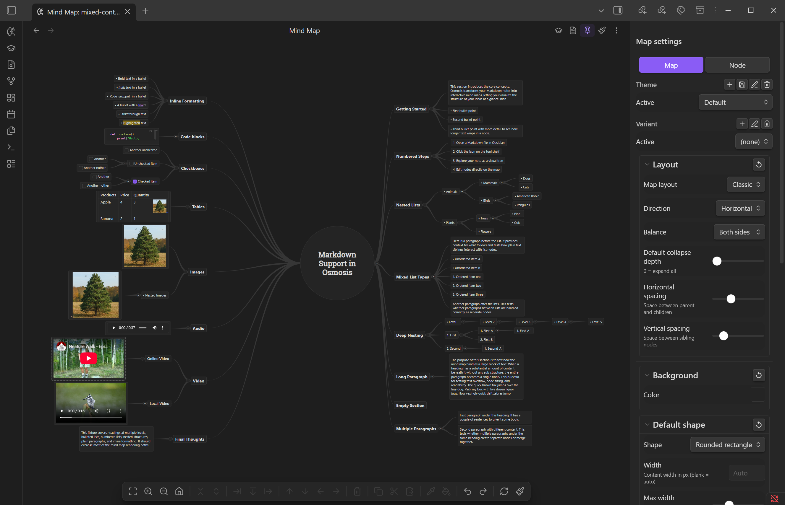
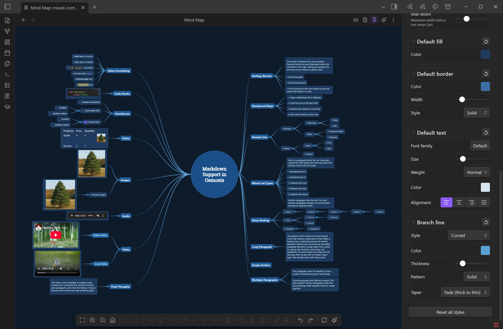
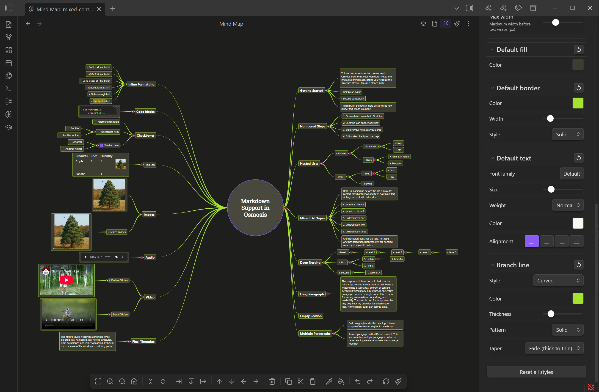
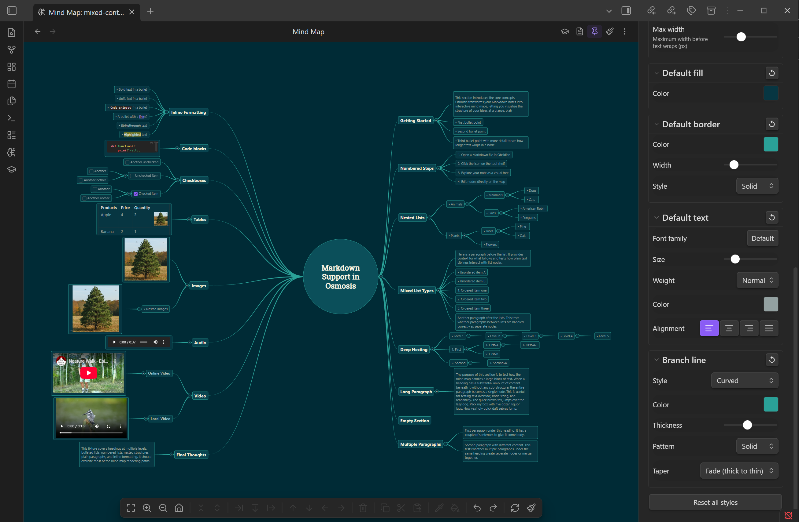
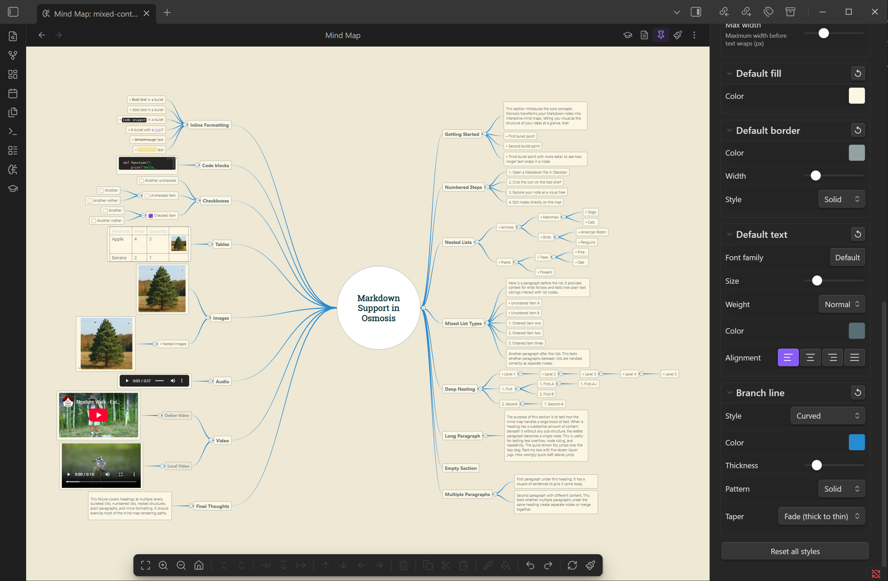

# Styling

## Properties Sidebar

Click the :lucide-paintbrush: icon in the mind map header to open the properties sidebar. It has two tabs:

### Map Tab

Global settings for the current map:

- **Theme** — Choose from 13 presets or create your own
- **Layout direction** — Left-right or top-down
- **Layout algorithm** — Classic (tree) or radial
- **Balance** — One-side, both-sides, or alternating
- **Layout side** — Right, left, down, or up (for one-side balance)
- **Spacing** — Horizontal (parent-to-child) and vertical (sibling) spacing
- **Branch lines** — Style, pattern, thickness, taper, and color
- **Node shape** — Default shape for all nodes
- **Max node width** — Text wraps at this width
- **Background color** — Map canvas color

### Format Tab

Style the currently selected node(s):

- **Shape** and custom width
- **Fill** color
- **Border** — Color, width, style (solid/dashed/dotted)
- **Text** — Font, size, weight, color, alignment (left/center/right/justify)
- **Branch line** — Per-node overrides for color, thickness, style, pattern, taper

Each section has a reset button to clear overrides.

## Themes

Osmosis includes 13 themes:











| Theme | Style |
|-------|-------|
| Default | Inherits your Obsidian theme colors |
| Ocean | Cool blues |
| Solarized Dark / Light | Ethan Schoonover's palette |
| Nord | Arctic blue tones |
| Dracula | Dark purple and pink |
| Monokai | High-contrast dark |
| Gruvbox Dark | Retro warm tones |
| Catppuccin Mocha | Pastel dark |
| Tokyo Night | Soft dark blues |
| Rose Pine | Muted pinks and purples |
| Everforest | Soft green earth tones |
| One Light | Clean, bright |

You can create, rename, and delete custom themes from the Map tab in the properties sidebar.

## Per-Map Settings

Map styles are stored in `osmosis-styles` frontmatter, so each note can have its own layout and appearance:

```yaml
---
osmosis-styles:
  direction: top-down
  theme: Nord
  balance: both-sides
  branchLineStyle: straight
  horizontalSpacing: 100
  verticalSpacing: 12
---
```

### All Map Properties

| Property | Values | Default |
|----------|--------|---------|
| `direction` | `left-right`, `top-down` | `left-right` |
| `theme` | Any preset or custom theme name | `Default` |
| `mapLayout` | `classic`, `radial` | `classic` |
| `balance` | `one-side`, `both-sides`, `alternating` | `one-side` |
| `layoutSide` | `right`, `left`, `down`, `up` | `right` |
| `branchLineStyle` | `curved`, `straight`, `angular`, `rounded-elbow` | `curved` |
| `branchLinePattern` | `solid`, `dashed`, `dotted` | `solid` |
| `branchLineTaper` | `none`, `fade`, `grow` | `none` |
| `topicShape` | See node shapes below | `rounded-rect` |
| `collapseDepth` | `0` (none) through `6` | `0` |
| `horizontalSpacing` | Pixels | `80` |
| `verticalSpacing` | Pixels | `8` |
| `maxNodeWidth` | Pixels | **Settings > Osmosis > Max node width** (`230`) |

## Per-Node Style Selectors

Individual nodes are styled via the `styles` map inside `osmosis-styles`. Keys select a node in one of three forms:

```yaml
---
osmosis-styles:
  styles:
    "^os-a1b2c3":                          # block ID (preferred)
      shape: diamond
      fill: "#e94560"
    "# Coffee Brewing/## Grinder Types":   # tree path
      fill: "#533483"
    "_n:a3f2b7c1d9e0":                     # stable ID (legacy, GUI-generated)
      shape: pill
---
```

| Selector | Form | Survives rename? | Survives reorder? |
|----------|------|------------------|-------------------|
| **Block ID** | `^os-a1b2c3` (any block ID works, including your own `^anchors`) | :material-check: | :material-check: |
| **Tree path** | Full ancestor path from the top heading, segments joined with `/`, each with its markdown prefix (`# `, `## `, `- `, `1. `) | :material-close: | :material-check: |
| **Stable ID** | `_n:` + content-position hash | :material-check: | :material-close: |

When several selectors match the same node, block ID wins, then stable ID, then tree path.

The Format tab writes **block-ID selectors** whenever the node has a block ID (see [line cards](../flashcards/line-cards.md) — the *Generate flashcards from note* command tags lines with them), and migrates a node's legacy `_n:` entry to the block-ID key on the next style change. Nodes without a block ID fall back to stable IDs. Tree paths are a power-user escape hatch for hand-editing frontmatter.

!!! warning "Tree paths are full paths"
    A tree-path selector must spell out the *entire* ancestor chain starting at the top-level heading — `"## Grinder Types"` alone matches nothing if the note has a `# Coffee Brewing` heading above it. Block IDs on lines are stripped before matching, so path segments never contain `^os-…`.

## Node Shapes

Osmosis supports 15 node shapes:

`rectangle` `rounded-rect` `ellipse` `circle` `diamond` `hexagon` `octagon` `triangle` `parallelogram` `trapezoid` `pill` `cloud` `arrow-right` `underline` `none`

## Branch Line Styles

**Style** controls the line geometry:

- `curved` — Smooth S-curves (default)
- `straight` — Direct lines
- `angular` — Right-angle bends
- `rounded-elbow` — Right-angle bends with rounded corners

**Pattern** controls the stroke:

- `solid` (default), `dashed`, `dotted`

**Taper** controls the line thickness variation:

- `none` (default) — Uniform thickness
- `fade` — Thinner toward children
- `grow` — Thicker toward children

## Style Cascade

When multiple style sources apply to the same node, they resolve in priority order (highest to lowest):

1. **Local** — Per-node style overrides (set via Format tab)
2. **Class** — Global style classes
3. **Variant** — Node variant overrides
4. **Reference** — Theme reference
5. **Theme** — Preset or custom theme (lowest priority)
