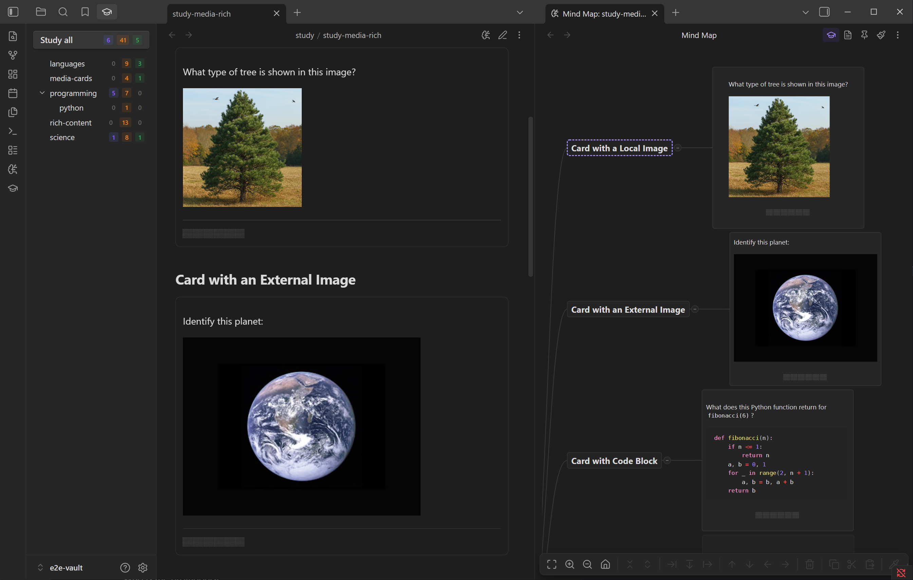
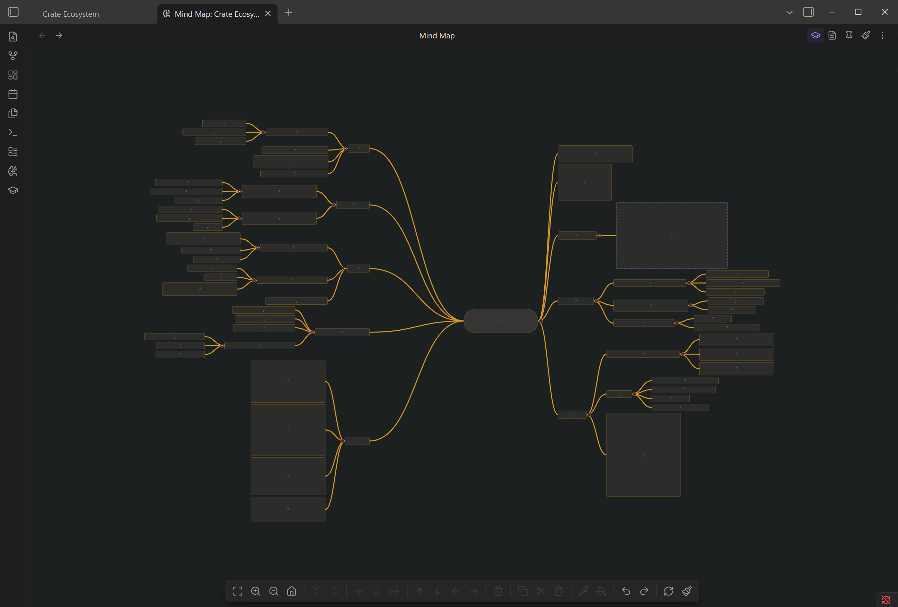
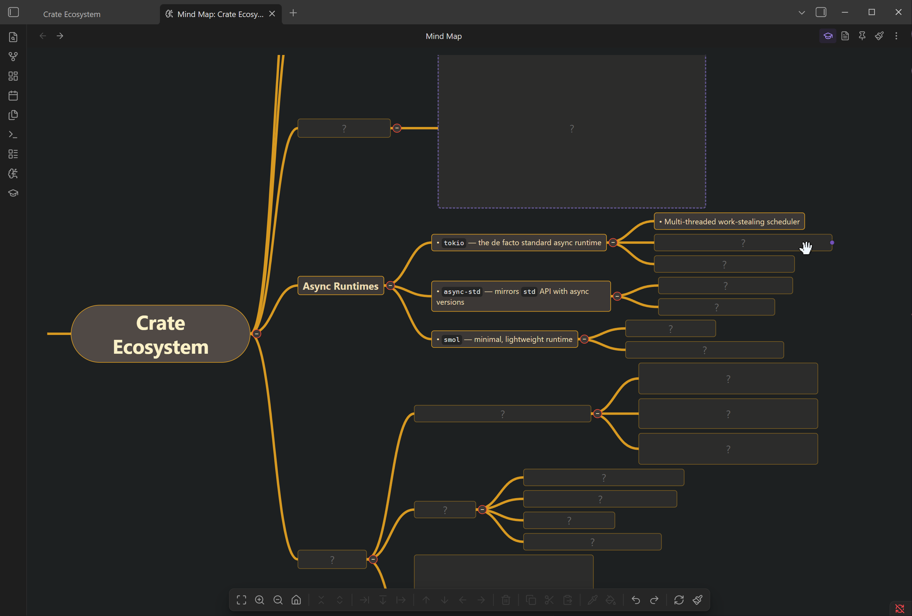

# Study Modes

## Sequential Study

Classic Anki-style card review in a modal dialog.

1. Open the **Dashboard** and click a deck (or "Study all")
2. The front of the card appears
3. Click **Show Answer** (or press ++space++) to reveal the back
4. Rate your recall: **Again** (++1++), **Hard** (++2++), **Good** (++3++), **Easy** (++4++)
5. The next card appears

A progress bar at the top tracks remaining cards.

!!! tip "Type-in cards"
    For type-in cards, a text input replaces the "Show Answer" button. Type your answer and submit to compare against the correct answer.

## Contextual Study

Study cards inline while reading your notes — no modal, no context switching.

1. Open a note with cards in **reading view**
2. `osmosis` fences appear as interactive cards
3. Click a card to reveal the answer
4. Rate with Again / Hard / Good / Easy

Contextual study activates automatically when you open a note with cards. This is configurable in settings.

!!! note
    FSRS scheduling applies when you rate cards in contextual mode, just like in sequential mode.

## Spatial Study

Study on the mind map itself. Concepts stay in their spatial context, reinforcing structural relationships.

1. Open a **mind map**
2. Click the :lucide-graduation-cap: icon in the mind map header
3. All nodes except the root hide behind `?` placeholders
4. **Click a node** to reveal its front (question)
5. **Rate** with Again / Hard / Good / Easy to reveal the back and schedule the card
6. Work through the map, revealing nodes as you go

Spatial study is especially powerful for topics where understanding the relationships between concepts matters as much as memorizing individual facts. The physical position of nodes on the map creates spatial memory associations that reinforce recall.

## Choosing a Mode

| Mode | Best for | Context |
|------|----------|---------|
| **Sequential** | Focused review, clearing a backlog | Modal dialog, no distractions |
| **Contextual** | Studying while reading | Inline in your notes |
| **Spatial** | Learning structure and relationships | On the mind map |

All three modes use the same FSRS scheduler — a card rated in one mode updates its schedule everywhere.
