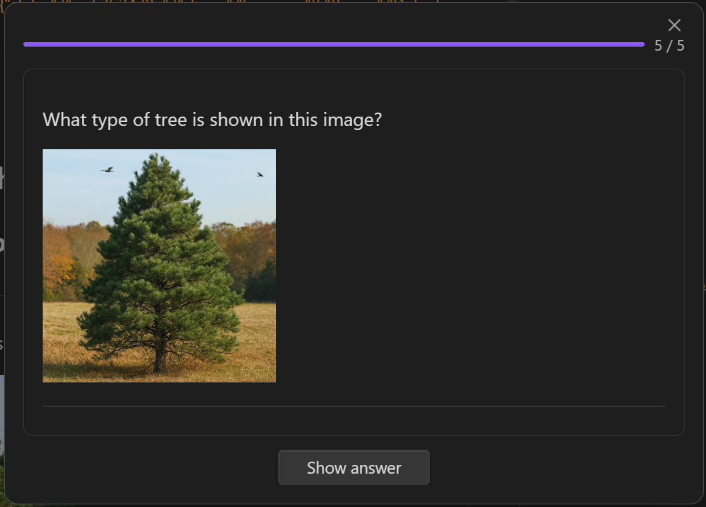
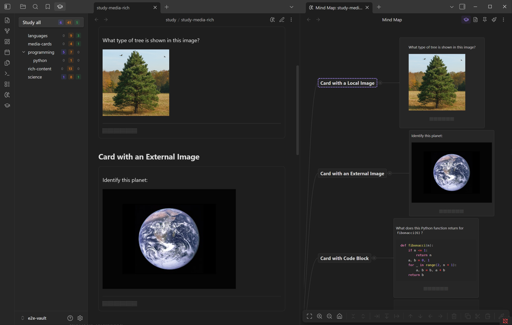
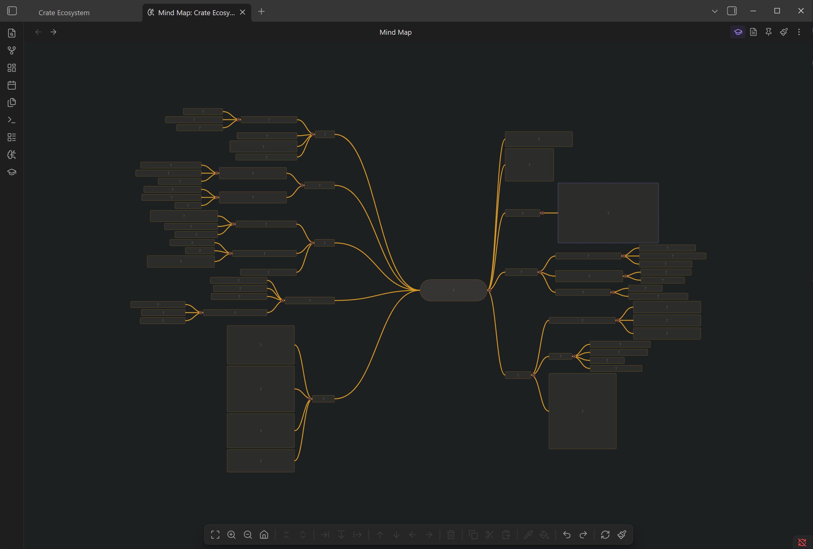
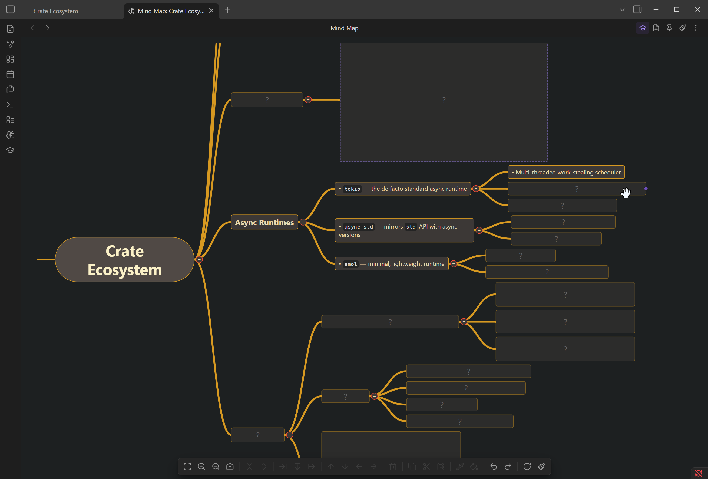

# Study Modes

## Sequential Study

Classic Anki-style card review in a modal dialog.

1. Open the **Dashboard** and click a deck (or "Study all")
2. The front of the card appears
3. Click **Show Answer** (or press ++space++) to reveal the back
4. Rate your recall: **Again** (++1++), **Hard** (++2++), **Good** (++3++), **Easy** (++4++)
5. The next card appears

A progress bar at the top tracks remaining cards.

!!! tip "Type-in cards"
    For type-in cards, a text input replaces the "Show Answer" button. Type your answer and submit to compare against the correct answer.

## Contextual Study

Study cards inline while reading your notes — no modal, no context switching. Reading view stays a normal reading surface by default: nothing is hidden until you ask for it.

### Fence Cards

1. Open a note with cards in **reading view**
2. `osmosis` fences appear as interactive cards with their answers hidden
3. Click a card to reveal the answer — a casual peek, nothing recorded
4. Click **Start studying** to activate FSRS rating; after each reveal, rate with Again / Hard / Good / Easy

Fence-card hiding activates automatically when you open a note with cards. This is configurable in settings.

### Line Cards: Peek & Study

On notes with [line cards](../flashcards/line-cards.md), two extra actions appear in the reading-view header, next to the reading/edit toggle:

- **Peek** (:lucide-scan-eye: icon) — hides *every* line-card line behind a `░░░░░░` placeholder. Click any placeholder to reveal it, in any order. Nothing is recorded — toggle off to return to normal reading.
- **Study** (:lucide-graduation-cap: icon) — hides only lines whose card is **due or new** (scheduling decides, like spatial mode). Reveal proceeds top-down, one line at a time; after each reveal a rating bubble appears below the line and must be answered before the next line unlocks. A floating pill tracks progress ("4/9 rated") with a **Stop** button, and a toast confirms completion. If nothing is due, the button tells you instead of entering study.

!!! note
    FSRS scheduling applies when you rate cards in contextual mode, just like in sequential mode. Ratings are batched into a single frontmatter write at session end.

## Spatial Study

Study on the mind map itself. Concepts stay in their spatial context, reinforcing structural relationships.

1. Open a **mind map** of a note with [line cards](../flashcards/line-cards.md)
2. Click the :lucide-graduation-cap: icon in the mind map header
3. Nodes whose card is **due or new** hide behind `?` placeholders — the rest of the map stays fully visible, because seeing how information fits together is the point
4. **Tap a hidden node** to reveal it
5. **Rate** with the bubble that appears below the node — Again (++1++), Hard (++2++), Good (++3++), Easy (++4++)
6. A floating pill tracks progress ("4/9 due reviewed") with a **Stop** button; a toast confirms when every due card is reviewed, and the map stays open

Spatial study is especially powerful for topics where understanding the relationships between concepts matters as much as memorizing individual facts. The physical position of nodes on the map creates spatial memory associations that reinforce recall.

!!! tip "Study a single branch"
    Right-click any node and choose **Study this branch** to scope the session to that subtree's due cards.

### Transcluded Content

Embedded notes (`![[note]]`) are first-class citizens in spatial study and peek: if the embedded note has line cards, its nodes hide and reveal on the host map just like local ones, and ratings are written to the **embedded note's** own `osmosis-schedule` — the schedule always lives with the note that owns the line. A card studied on a host map and in its home note is the same card, so scheduling stays consistent everywhere.

- Embedded notes without flashcards (no `osmosis-cards` opt-in, or no generated block IDs) simply stay visible as context.
- A note whose line cards are [opted out of decks](../flashcards/line-cards.md) is still studiable in place — opt-out only affects decks and sequential study.
- Embedding the same note twice puts both copies on one card: revealing one reveals the other, and it is rated (and counted) once.

Contextual (reading-view) study deliberately leaves `![[embeds]]` alone — study an embedded note's lines in its own reading view or on a map that includes it.

### Peek on the Map

The :lucide-scan-eye: icon next to the study button enters **peek mode**: every line-card node hides, you reveal them in any order by tapping, and nothing is recorded — the map equivalent of covering the page with your hand.

## Choosing a Mode

| Mode | Best for | Context |
|------|----------|---------|
| **Sequential** | Focused review, clearing a backlog | Modal dialog, no distractions |
| **Contextual** | Studying while reading | Inline in your notes |
| **Spatial** | Learning structure and relationships | On the mind map |

All three modes use the same FSRS scheduler — a card rated in one mode updates its schedule everywhere.
